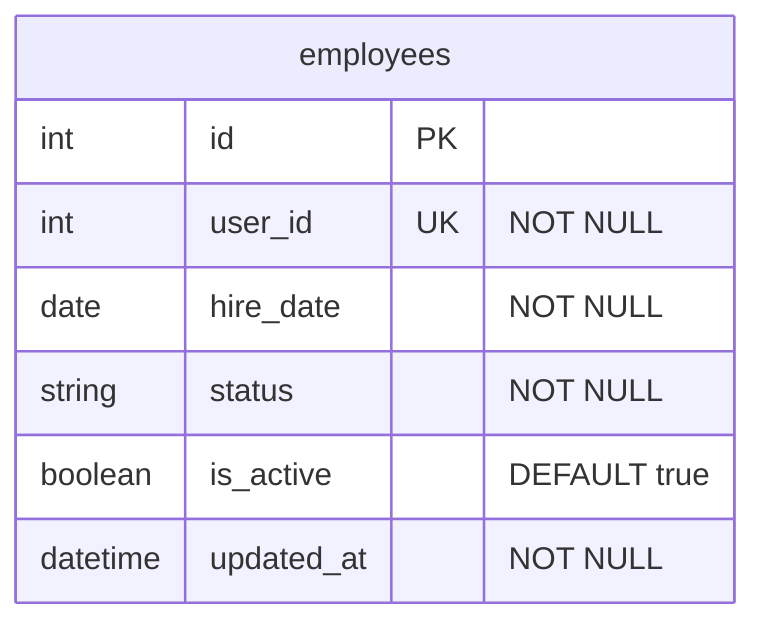

# Сервис статуса сотрудника (Employee Status Service) – Вариант 10

## Список функций
- `create_employee` – создание записи о статусе сотрудника
- `update_employee` – изменение статусной информации сотрудника
- `delete_employee` – мягкое удаление сотрудника (is_active = False)
- `get_employee` – получение статусной информации сотрудника по ID
- `list_employees` – получение списка сотрудников с фильтрацией

> Примечание: ФИО, контакты, должности, отпуска и больничные листы хранятся в смежных микросервисах компании. Данный сервис является мастер-системой исключительно для оперативного статуса занятости сотрудника и использует `user_id` для интеграции.

---

## Сущность «Сотрудник»

### 1. Создание сотрудника (`create_employee`)

**Информация, требуемая для создания сотрудника**

| Параметр | Пояснение | Обязательность | Тип | Ограничение | Значение по умолчанию |
|----------|-----------|----------------|-----|-------------|-----------------------|
| `user_id` | ID сотрудника из Profile Service | Да | int | уникальный | – |
| `hire_date` | Дата найма | Да | date | не раньше 1900-01-01 | – |
| `status` | Текущий статус | Нет | string | active / on_vacation / sick_leave / fired | `'active'` |

**Информация, возвращаемая при успешном создании**

| Параметр | Пояснение | Тип |
|----------|-----------|-----|
| `id` | Внутренний ID записи | int |
| `user_id` | ID из Profile Service | int |
| `hire_date` | Дата найма | date |
| `status` | Текущий статус | string |
| `updated_at` | Дата и время создания | datetime |

---

### 2. Изменение сотрудника по ID (`update_employee`)

**Информация, требуемая для изменения** (все поля опциональны)

| Параметр | Пояснение | Обязательность | Тип | Ограничение | Значение по умолчанию |
|----------|-----------|----------------|-----|-------------|-----------------------|
| `hire_date` | Дата найма | Нет | date | не раньше 1900-01-01 | – |
| `status` | Статус | Нет | string | active / on_vacation / sick_leave / fired | – |

**Информация, возвращаемая при успешном изменении**

| Параметр | Пояснение | Тип |
|----------|-----------|-----|
| `id` | Внутренний ID записи | int |
| `user_id` | ID из Profile Service | int |
| `status` | Текущий статус | string |
| `updated_at` | Дата и время последнего обновления | datetime |

---

### 3. Удаление сотрудника по ID (`delete_employee`)

> Метод производит логическое (мягкое) удаление. Изменяет значение флага `is_active` на `False`. Физического удаления записи из базы данных не происходит, данные не зачищаются. Возвращает `True` при успешном изменении, иначе `False`.

---

### 4. Получение сотрудника по ID (`get_employee`)

**Информация, возвращаемая при успешном поиске**

| Параметр | Пояснение | Тип |
|----------|-----------|-----|
| `id` | Внутренний ID записи | int |
| `user_id` | ID из Profile Service | int |
| `hire_date` | Дата найма | date |
| `status` | Текущий статус | string |
| `is_active` | Флаг активности аккаунта | boolean |
| `updated_at` | Дата и время последнего обновления | datetime |

---

### 5. Получение списка сотрудников по заданным параметрам (`list_employees`)

**Параметры для получения списка**

| Параметр | Пояснение | Обязательность | Тип | Ограничение | Значение по умолчанию |
|----------|-----------|----------------|-----|-------------|-----------------------|
| `user_id` | ID сотрудника | Нет | int | точное совпадение | – |
| `status` | Статус | Нет | string | точное совпадение | – |
| `hire_date_from` | Дата найма от | Нет | date | диапазон (`>=`) | – |
| `hire_date_to` | Дата найма до | Нет | date | диапазон (`<=`) | – |
| `limit` | Лимит записей | Нет | int | пагинация | `100` |
| `offset` | Смещение | Нет | int | пагинация | – |

**Информация, возвращаемая в виде списка сотрудников** (каждый элемент)

| Параметр | Пояснение | Тип |
|----------|-----------|-----|
| `id` | Внутренний ID записи | int |
| `user_id` | ID из Profile Service | int |
| `hire_date` | Дата найма | date |
| `status` | Текущий статус | string |

---

## ER-диаграмма

### Описание ограничений БД
1. **Таблица `employees` (Сотрудники)** — единственная таблица сервиса. Хранит исключительно статусную информацию.
2. **Мягкое удаление** реализуется через контролируемый флаг `is_active`. Физическое каскадное зачищение данных отсутствует.
