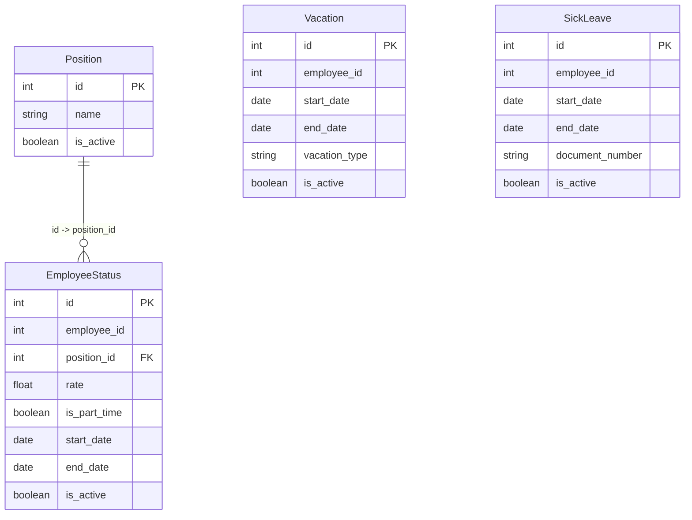

# Employee Status Service

## ER-диаграмма

# Position

## 1. Добавить сущность

### Информация для создания

| Параметр (англ.) | Пояснение | Обязательность | Тип | Ограничение | Значение по умолчанию |
|---|---|---|---|---|---|
| name | Наименование должности | Да | string | ≤255 символов | - |

### Уникальные комбинации параметров

| Параметр |
|---|
| name |

### Информация при успешном создании

| Параметр (англ.) | Тип |
|---|---|
| id | integer |

## 2. Изменить сущность по ID

### Информация для изменения

| Параметр (англ.) | Пояснение | Обязательность | Тип | Ограничение |
|---|---|---|---|---|
| name | Наименование должности | Нет | string | ≤255 символов |

### Информация при успешном изменении

| Параметр (англ.) | Тип |
|---|---|
| result | boolean |

...
