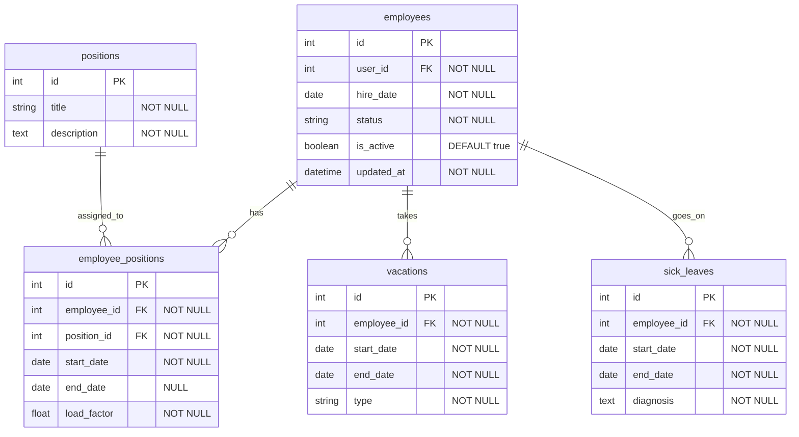

# Сервис статуса сотрудника (Employee Status Service) – Вариант 10

## Список функций
- `create_employee` – создание записи о сотруднике
- `update_employee` – изменение статусной информации сотрудника
- `delete_employee` – мягкое удаление (is_active = False)
- `get_employee` – получение сотрудника по ID
- `list_employees` – получение списка сотрудников с фильтрацией и пагинацией

---

## Сущность «Сотрудник»

### 1. Создание сотрудника (`create_employee`)

**Информация, требуемая для создания сотрудника**

| Параметр | Пояснение | Обязательность | Тип | Ограничение | Значение по умолчанию |
|----------|-----------|----------------|-----|-------------|-----------------------|
| `user_id` | ID сотрудника из Profile Service | Да | int | уникальный | – |
| `hire_date` | Дата найма | Да | date | не раньше 1900-01-01 | – |
| `status` | Текущий статус | Нет | string | active / on_vacation / sick_leave / fired | `'active'` |

**Информация, возвращаемая при успешном создании**

| Параметр | Пояснение | Тип |
|----------|-----------|-----|
| `id` | Внутренний ID записи (PK) | int |
| `user_id` | ID из Profile Service | int |
| `hire_date` | Дата найма | date |
| `status` | Текущий статус | string |
| `updated_at` | Дата и время создания | datetime |

---

### 2. Изменение сотрудника по ID (`update_employee`)

**Информация, требуемая для изменения** (все поля опциональны)

| Параметр | Пояснение | Обязательность | Тип | Ограничение | Значение по умолчанию |
|----------|-----------|----------------|-----|-------------|-----------------------|
| `hire_date` | Дата найма | Нет | date | не раньше 1900-01-01 | – |
| `status` | Статус | Нет | string | active / on_vacation / sick_leave / fired | – |

**Информация, возвращаемая при успешном изменении**

| Параметр | Пояснение | Тип |
|----------|-----------|-----|
| `id` | Внутренний ID записи | int |
| `user_id` | ID из Profile Service | int |
| `hire_date` | Дата найма | date |
| `status` | Текущий статус | string |
| `updated_at` | Дата и время последнего обновления | datetime |

---

### 3. Удаление сотрудника по ID (`delete_employee`)

> Метод производит логическое (мягкое) удаление путем перевода флага `is_active` в `False`. Физического зачищения строк в БД не происходит.

---

### 4. Получение сотрудника по ID (`get_employee`)

**Информация, возвращаемая при успешном поиске**

| Параметр | Пояснение | Тип |
|----------|-----------|-----|
| `id` | Внутренний ID записи | int |
| `user_id` | ID из Profile Service | int |
| `hire_date` | Дата найма | date |
| `status` | Текущий статус | string |
| `is_active` | Статус активности записи | boolean |
| `updated_at` | Дата и время последнего обновления | datetime |
| `positions` | Список должностей со структурой `[{"position_title": string, "start_date": string, "end_date": string, "load_factor": float}]` | list |

---

### 5. Получение списка сотрудников по заданным параметрам (`list_employees`)

**Параметры для получения списка**

| Параметр | Пояснение | Обязательность | Тип | Ограничение | Значение по умолчанию |
|----------|-----------|----------------|-----|-------------|-----------------------|
| `user_id` | ID сотрудника | Нет | int | точное совпадение | – |
| `status` | Статус | Нет | string | точное совпадение | – |
| `position_id` | Должность | Нет | int | фильтрация через транзитивную таблицу | – |
| `hire_date_from` | Дата найма от | Нет | date | диапазон (`>=`) | – |
| `hire_date_to` | Дата найма до | Нет | date | диапазон (`<=`) | – |
| `limit` | Лимит записей | Нет | int | пагинация | `100` |
| `offset` | Смещение | Нет | int | для пагинации | – |

**Информация, возвращаемая в виде списка сотрудников**

| Параметр | Пояснение | Тип |
|----------|-----------|-----|
| `id` | Внутренний ID записи | int |
| `user_id` | ID из Profile Service | int |
| `hire_date` | Дата найма | date |
| `status` | Текущий статус | string |
| `is_active` | Статус активности записи (учёт мягкого удаления) | boolean |

---

## ER-диаграмма

### Архитектурные пояснения к схемам и методам

1. **Реляционные связи со сторонними сервисами**
   Сущность `employees` связана с внешней таблицей `profiles` сервиса **Profile Service** отношением один-к-одному. Связывание происходит по внешнему ключу: `employees.user_id` ➔ `profiles.id`. Данная связь является логической межсервисной и не поддерживается на уровне ограничений СУБД SQLite.

2. **Внутренние связи и каскадность**
   - **`employees` ➔ `employee_positions`**: по полям `employees.id` (PK) и `employee_positions.employee_id` (FK), один-ко-многим.
   - **`positions` ➔ `employee_positions`**: по полям `positions.id` (PK) и `employee_positions.position_id` (FK), один-ко-многим.
   - **`employees` ➔ `vacations`**: по полям `employees.id` (PK) и `vacations.employee_id` (FK), один-ко-многим.
   - **`employees` ➔ `sick_leaves`**: по полям `employees.id` (PK) and `sick_leaves.employee_id` (FK), один-ко-многим.

3. **Формирование сложных структур**
   Параметр `positions` в ответе `get_employee` формируется с помощью выполнения SQL JOIN-запроса между промежуточной таблицей `employee_positions` (фильтрация по `employee_id`) и справочником `positions` для получения актуальных названий должностей (`title`). На уровне ORM-модели за это отвечает встроенное вычисляемое свойство `.positions`.

4. **Согласование каскадного и мягкого удаления**
   Мягкое удаление сущности `Employee` изменяет флаг `is_active = False` и не инициирует физическое удаление данных. Ограничение базы данных `ON DELETE CASCADE` для внешних ключей заложено в схему как защитный механизм на случай принудительной очистки мастер-данных (например, при полном физическом удалении профиля пользователя администратором).

5. **Отсутствие CRUD для дополнительных таблиц**
   Таблицы `vacations` и `sick_leaves` являются вспомогательными историческими логами. Они не имеют собственных независимых конечных точек API, так как записи в них создаются/изменяются автоматически в рамках единой транзакции при обновлении оперативного статуса сотрудника через метод `update_employee`.
