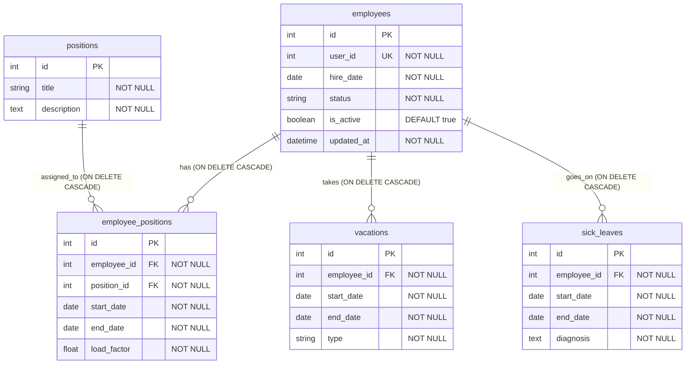

# Сервис статуса сотрудника (Employee Status Service) – Вариант 10

## Список функций
- `create_employee` – создание записи о сотруднике (только статусная информация)
- `update_employee` – изменение статусной информации сотрудника
- `delete_employee` – мягкое удаление (is_active = False)
- `get_employee` – получение сотрудника по ID
- `list_employees` – получение списка сотрудников с фильтрацией

> Примечание: ФИО, контакты и другие персональные данные хранятся в **Profile Service**. В данном сервисе используется `user_id` для связи с профилем.

---

## Сущность «Сотрудник»

### 1. Создание сотрудника

**Информация, требуемая для создания сотрудника**

| Параметр | Пояснение | Обязательность | Тип | Ограничение | Значение по умолчанию |
|----------|-----------|----------------|-----|-------------|-----------------------|
| `user_id` | ID сотрудника из Profile Service | Да | int | уникальный (UK) | – |
| `hire_date` | Дата найма | Да | date | не раньше 1900-01-01 | – |
| `status` | Текущий статус | Нет | string | active / on_vacation / sick_leave / fired | `'active'` |

**Информация, возвращаемая при успешном создании**

| Параметр | Пояснение | Тип |
|----------|-----------|-----|
| `id` | Внутренний ID записи (PK) | int |
| `user_id` | ID из Profile Service (UK) | int |
| `hire_date` | Дата найма | date |
| `status` | Текущий статус | string |
| `updated_at` | Дата и время создания/обновления | datetime |

---

### 2. Изменение сотрудника по ID (`update_employee`)

**Информация, требуемая для изменения** (все поля опциональны)

| Параметр | Пояснение | Обязательность | Тип | Ограничение | Значение по умолчанию |
|----------|-----------|----------------|-----|-------------|-----------------------|
| `hire_date` | Дата найма | Нет | date | не раньше 1900-01-01 | – |
| `status` | Статус | Нет | string | active / on_vacation / sick_leave / fired | – |

**Информация, возвращаемая при успешном изменении**

| Параметр | Пояснение | Тип |
|----------|-----------|-----|
| `id` | Внутренний ID записи | int |
| `user_id` | ID из Profile Service | int |
| `status` | Текущий статус | string |
| `updated_at` | Дата и время последнего обновления | datetime |

---

### 3. Удаление сотрудника по ID (`delete_employee`)

> Метод производит логическое (мягкое) удаление. Меняет значение флага `is_active` на `False`. Физического удаления записи из базы данных не происходит. Возвращает `True` при успешном изменении статуса, иначе `False`.

---

### 4. Получение сотрудника по ID (`get_employee`)

**Информация, возвращаемая при успешном поиске**

| Параметр | Пояснение | Тип |
|----------|-----------|-----|
| `id` | Внутренний ID записи (PK) | int |
| `user_id` | ID из Profile Service (UK) | int |
| `hire_date` | Дата найма | date |
| `status` | Текущий статус | string |
| `updated_at` | Дата и время последнего обновления | datetime |
| `positions` | Список должностей со структурой `[{"position_title": string, "start_date": string, "end_date": string, "load_factor": float}]` | list |

---

### 5. Получение списка сотрудников по заданным параметрам (`list_employees`)

**Параметры для получения списка**

| Параметр | Пояснение | Тип | Описание |
|----------|-----------|-----|-----------|
| `user_id` | ID сотрудника | int | Точное совпадение |
| `status` | Статус | string | Точное совпадение |
| `position_id` | Должность | int | Фильтрация через транзитивную таблицу `employee_positions` |
| `hire_date_from` | Дата найма от | date | Фильтрация по диапазону (`>=`) |
| `hire_date_to` | Дата найма до | date | Фильтрация по диапазону (`<=`) |
| `limit` | Лимит | int | Максимум записей (default 100) |
| `offset` | Смещение | int | Для пагинации |

**Информация, возвращаемая в виде списка сотрудников** (каждый элемент)

| Параметр | Пояснение | Тип |
|----------|-----------|-----|
| `id` | Внутренний ID записи | int |
| `user_id` | ID из Profile Service | int |
| `hire_date` | Дата найма | date |
| `status` | Текущий статус | string |

---

## ER-диаграмма (Синхронизирована с моделями)

### Описание таблиц и ограничений БД

1. **Таблица `employees` (Сотрудники)**
   - Поле `user_id` логически является уникальным внешним ключом (`UK`), ссылающимся на стороннюю сущность в *Profile Service*. Так как внешняя база физически недоступна для контроля ограничений целостности, поле оформлено в локальной схеме как `unique=True` (`UK`).
   - Поле `is_active` отвечает за мягкое удаление.
   - Поле `status` имеет ограничение на уровне кода на вхождение в список `['active', 'on_vacation', 'sick_leave', 'fired']`. По умолчанию при создании в БД через API (если не передано явно) присваивается значение `'active'`.

2. **Таблица `positions` (Должности)**
   - Справочник доступных должностей компании. Ограничение длины строки `title` составляет 100 символов.

3. **Таблица `employee_positions` (Связи сотрудников и должностей)**
   - Транзитивная сущность для реализации связи «многие-ко-многим». Поле `load_factor` хранит число с плавающей точкой в стандартном формате IEEE 754 (точность `float` в Python/SQLite).
   - Заданы правила каскадного удаления: при физическом удалении профиля сотрудника или должности из системы, соответствующие связи зачищаются автоматически (`ON DELETE CASCADE`).

4. **Таблицы `vacations` и `sick_leaves` (Отпуска и Больничные)**
   - Относятся к сотруднику как один-ко-многим. Не содержат избыточных флагов удаления, так как жизненный цикл записей полностью зависит от родительской сущности `employees` и очищается каскадно (`ON DELETE CASCADE`). Все поля имеют ограничение `NOT NULL`.
