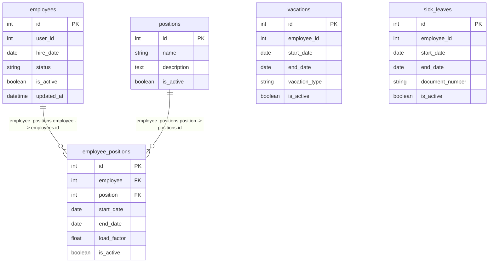

# Вариант 10 — Сервис статуса сотрудника (Employee Status Service)

## Список функций
- `create_employee` – создание записи о сотруднике
- `update_employee` – изменение статусной информации сотрудника
- `delete_employee` – мягкое удаление (is_active = False)
- `get_employee` – получение сотрудника по ID
- `list_employees` – получение списка сотрудников с фильтрацией
- Управление справочником должностей (`positions`) и историей назначений (`employee_positions`)
- Ведение логов причин отсутствия сотрудников по отпускам (`vacations`) и больничным (`sick_leaves`)

> Примечание: ФИО, контакты и персональные данные сотрудников хранятся в Profile Service. В данном сервисе используется `user_id` для связи.

---

## Сущность «Сотрудник»

### 1. Добавить сущность (`create_employee`)

**Информация для создания (таблица):**

| Параметр (англ.) | Пояснение | Обязательность | Тип | Ограничение | Значение по умолчанию |
|----------|-----------|----------------|-----|-------------|-----------------------|
| `user_id` | ID сотрудника из Profile Service | Да | int | уникальный, положительное целое число (>0) | – |
| `hire_date` | Дата найма | Да | date | не раньше 1900-01-01 | – |
| `status` | Текущий статус | Нет | string | active / on_vacation / sick_leave / fired | `'active'` |

**Уникальные комбинации параметров:** `user_id`

**Информация при успешном создании (таблица):**

| Параметр (англ.) | Тип |
|----------|-----|
| `id` | int |
| `user_id` | int |
| `hire_date` | date |
| `status` | string |

---

### 2. Изменение сущности по ID (`update_employee`)

**Информация для изменения (таблица):**

| Параметр (англ.) | Пояснение | Обязательность | Тип | Ограничение |
|----------|-----------|----------------|-----|-------------|
| `hire_date` | Дата найма | Нет | date | не раньше 1900-01-01 |
| `status` | Статус | Нет | string | active / on_vacation / sick_leave / fired |

**Информация при успешном изменении (таблица):**

| Параметр (англ.) | Тип |
|----------|-----|
| `id` | int |
| `user_id` | int |
| `status` | string |

---

### 3. Удалить сущность по ID (`delete_employee`)

- Удаление логическое (запись не удаляется из БД физически).
- В таблице присутствует булево поле `is_active` (по умолчанию `True`).
- При удалении `is_active` устанавливается в `False`.
- Возвращаемое значение: `true` (если запись найдена и помечена удалённой), иначе `false`.

---

### 4. Получить сущность по ID (`get_employee`)

**Возвращаемая информация (таблица):**

| Параметр (англ.) | Пояснение | Тип |
|----------|-----------|-----|
| `id` | Внутренний ID записи | int |
| `user_id` | ID из Profile Service | int |
| `hire_date` | Дата найма | date |
| `status` | Текущий статус | string |

---

### 5. Получить список сущностей по заданным параметрам (`list_employees`)

**Параметры запроса (таблица):**

| Параметр (англ.) | Пояснение | Тип |
|----------|-----------|-----|
| `user_id` | ID сотрудника для точного совпадения | int |
| `status` | Статус для точного совпадения | string |
| `position` | Идентификатор должности для фильтрации | int |
| `hire_date_from` | Дата найма от | date |
| `hire_date_to` | Дата найма до | date |
| `limit` | Лимит выборки | int |
| `offset` | Смещение для пагинации | int |

**Возвращаемый список (таблица с полями сущности):**

| Параметр (англ.) | Тип |
|----------|-----|
| `id` | int |
| `user_id` | int |
| `hire_date` | date |
| `status` | string |

---

## Дополнительное описание API сопутствующих таблиц

### 6. Таблица Должностей (`positions`)

#### 6.1 Добавить должность
**Информация для создания (таблица):**

| Параметр (англ.) | Пояснение | Обязательность | Тип | Ограничение | Значение по умолчанию |
|----------|-----------|----------------|-----|-------------|-----------------------|
| `name` | Название должности | Да | string | макс. 100 символов, уникальное | – |
| `description` | Описание | Да | text | – | – |

**Уникальные комбинации параметров:** `name`

**Информация при успешном создании (таблица):**

| Параметр (англ.) | Тип |
|----------|-----|
| `id` | int |
| `name` | string |
| `description` | text |

#### 6.2 Изменить должность по ID
**Информация для изменения (таблица):**

| Параметр (англ.) | Пояснение | Обязательность | Тип | Ограничение |
|----------|-----------|----------------|-----|-------------|
| `name` | Название должности | Нет | string | макс. 100 символов |
| `description` | Описание | Нет | text | – |

**Информация при успешном изменении (таблица):**

| Параметр (англ.) | Тип |
|----------|-----|
| `id` | int |
| `name` | string |
| `description` | text |

#### 6.3 Удалить должность по ID
Реализует мягкое логическое удаление записи из БД (флаг `is_active`). Возвращает `true / false`.

#### 6.4 Получить должность по ID
**Возвращаемая информация (таблица):**

| Параметр (англ.) | Пояснение | Тип |
|----------|-----------|-----|
| `id` | Первичный ключ | int |
| `name` | Название должности | string |
| `description` | Описание обязанностей | text |

#### 6.5 Получить список должностей
- **Входные данные:** `limit` (int), `offset` (int).
- **Выходные данные:** Массив объектов структуры должности.

---

### 7. Транзитивная таблица назначений (`employee_positions`)

#### 7.1 Добавить назначение
- **Входные данные:** `employee` (int), `position` (int), `start_date` (date), `end_date` (date), `load_factor` (float).
- **Выходные данные:** Полный объект структуры созданной связи назначений.

#### 7.2 Изменить назначение по ID
- **Входные данные:** `id` (int), `end_date` (date), `load_factor` (float).
- **Выходные данные:** Измененный объект структуры назначения.

#### 7.3 Удалить назначение по ID
Реализует мягкое логическое удаление связи из БД (`is_active`). Возвращает `true / false`.

#### 7.4 Получить назначение по ID
- **Входные данные:** `id` (int).
- **Выходные данные:** Объект структуры назначения.

#### 7.5 Получить список назначений
- **Входные данные:** `employee` (int).
- **Выходные данные:** Массив объектов структуры назначения.

---

### 8. Логирование отпусков (`vacations`)

#### 8.1 Добавить отпуск
- **Входные данные:** `employee_id` (int), `start_date` (date), `end_date` (date), `vacation_type` (string, макс. 255 символов).
- **Выходные данные:** Объект структуры созданной записи отпуска.

#### 8.2 Изменить отпуск по ID
- **Входные данные:** `id` (int), `start_date` (date), `end_date` (date), `vacation_type` (string).
- **Выходные данные:** Измененная запись отпуска.

#### 8.3 Удалить отпуск по ID
Реализует мягкое логическое удаление. Возвращает `true / false`.

#### 8.4 Получить отпуск по ID
**Возвращаемая информация (таблица):**

| Параметр (англ.) | Пояснение | Тип |
|----------|-----------|-----|
| `id` | Первичный ключ | int |
| `employee_id` | Внешний ID сотрудника из стороннего сервиса | int |
| `start_date` | Дата начала | date |
| `end_date` | Дата окончания | date |
| `vacation_type` | Тип отпуска | string |
| `is_active` | Активность записи | boolean |

#### 8.5 Получить список отпусков
- **Входные данные:** `employee_id` (int).
- **Выходные данные:** Массив объектов структуры отпуска.

---

### 9. Логирование больничных (`sick_leaves`)

#### 9.1 Добавить больничный
- **Входные данные:** `employee_id` (int), `start_date` (date), `end_date` (date), `document_number` (string, макс. 255 символов).
- **Выходные данные:** Объект структуры созданной записи больничного.

#### 9.2 Изменить больничный по ID
- **Входные данные:** `id` (int), `start_date` (date), `end_date` (date), `document_number` (string).
- **Выходные данные:** Измененный объект больничного лога.

#### 9.3 Удалить больничный по ID
Реализует логическое удаление записи из БД. Возвращает `true / false`.

#### 9.4 Получить больничный по ID
**Возвращаемая информация (таблица):**

| Параметр (англ.) | Пояснение | Тип |
|----------|-----------|-----|
| `id` | Первичный ключ | int |
| `employee_id` | Внешний ID сотрудника из стороннего сервиса | int |
| `start_date` | Дата начала | date |
| `end_date` | Дата окончания | date |
| `document_number` | Номер документа | string |
| `is_active` | Активность записи | boolean |

#### 9.5 Получить список больничных
- **Входные данные:** `employee_id` (int).
- **Выходные данные:** Массив объектов структуры больничного листа.

---

## ER-диаграмма

> Архитектурное примечание: Поля `employee_id` в таблицах `vacations` и `sick_leaves` семантически являются внешними ключами на сущность из стороннего сервиса (`Auth Service` / `Profile Service`). Согласно техническим регламентам, межсервисные связи не соединяются линиями отношений на локальной схеме СУБД данного сервиса во избежание избыточности данных.

### Список реляционных связей:
- `employee_positions.employee -> employees.id` (Внутренний внешний ключ связи назначения с сотрудником)
- `employee_positions.position -> positions.id` (Внутренний внешний ключ связи назначения со справочником должностей)
