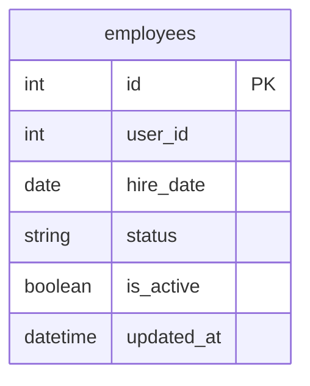

# Вариант 10 — Сервис статуса сотрудника (Employee Status Service)

## Список функций
- `create_employee` – создание записи о статусе сотрудника
- `update_employee` – изменение статусной информации сотрудника
- `delete_employee` – мягкое удаление сотрудника (is_active = False)
- `get_employee` – получение статусной информации сотрудника по ID
- `list_employees` – получение списка сотрудников с фильтрацией и пагинацией

> Важно: Сервис является узкоспециализированным и хранит исключительно оперативную статусную информацию о занятости сотрудников. Персональные данные (ФИО, контакты) хранятся в Profile Service, а учет должностей, отпусков и больничных вынесен в отдельные специализированные HR-сервисы компании. Межсервисная интеграция осуществляется через сквозной идентификатор `user_id`.

---

## Сущность «Сотрудник»

### 1. Добавить сущность (`create_employee`)

**Информация для создания (таблица):**

| Параметр (англ.) | Пояснение | Обязательность | Тип | Ограничение | Значение по умолчанию |
|----------|-----------|----------------|-----|-------------|-----------------------|
| `user_id` | ID сотрудника из Profile Service | Да | int | уникальный, положительное целое число (>0) | – |
| `hire_date` | Дата найма | Да | date | не раньше 1900-01-01 | – |
| `status` | Текущий статус | Нет | string | active / on_vacation / sick_leave / fired | `'active'` |

**Уникальные комбинации параметров:** `user_id`

**Информация при успешном создании (таблица):**

| Параметр (англ.) | Тип |
|----------|-----|
| `id` | int |
| `user_id` | int |
| `hire_date` | date |
| `status` | string |

---

### 2. Изменить сущность по ID (`update_employee`)

**Информация для изменения (таблица):**

| Параметр (англ.) | Пояснение | Обязательность | Тип | Ограничение |
|----------|-----------|----------------|-----|-------------|
| `hire_date` | Дата найма | Нет | date | не раньше 1900-01-01 |
| `status` | Статус | Нет | string | active / on_vacation / sick_leave / fired |

**Информация при успешном изменении (таблица):**

| Параметр (англ.) | Тип |
|----------|-----|
| `id` | int |
| `user_id` | int |
| `status` | string |

---

### 3. Удалить сущность по ID (`delete_employee`)

- Удаление логическое (запись не удаляется из БД физически).
- В таблице присутствует булево поле `is_active` (по умолчанию `True`).
- При удалении `is_active` устанавливается в `False`.
- Возвращаемое значение: `true` (если запись найдена и помечена удалённой), иначе `false`.

---

### 4. Получить сущность по ID (`get_employee`)

**Возвращаемая информация (таблица):**

| Параметр (англ.) | Пояснение | Тип |
|----------|-----------|-----|
| `id` | Внутренний ID записи | int |
| `user_id` | ID из Profile Service | int |
| `hire_date` | Дата найма | date |
| `status` | Текущий статус | string |
| `is_active` | Статус активности записи | boolean |
| `updated_at` | Дата и время последнего изменения | datetime |

---

### 5. Получить список сущностей по заданным параметрам (`list_employees`)

**Параметры запроса (таблица):**

| Параметр (англ.) | Пояснение | Тип |
|----------|-----------|-----|
| `user_id` | ID сотрудника для точного совпадения | int |
| `status` | Статус для точного совпадения | string |
| `hire_date_from` | Дата найма от | date |
| `hire_date_to` | Дата найма до | date |
| `limit` | Лимит выборки | int |
| `offset` | Смещение для пагинации | int |

**Возвращаемый список (таблица с полями сущности):**

| Параметр (англ.) | Тип |
|----------|-----|
| `id` | int |
| `user_id` | int |
| `hire_date` | date |
| `status` | string |

---

## ER-диаграмма

### Список реляционных связей:
- Локальные реляционные связи внутри базы данных отсутствуют, так как сервис оперирует единственной изолированной мастер-сущностью `employees`. Внешняя интеграция с иными сервисами распределенной системы построена на уровне логических ссылок по полю `user_id`.
