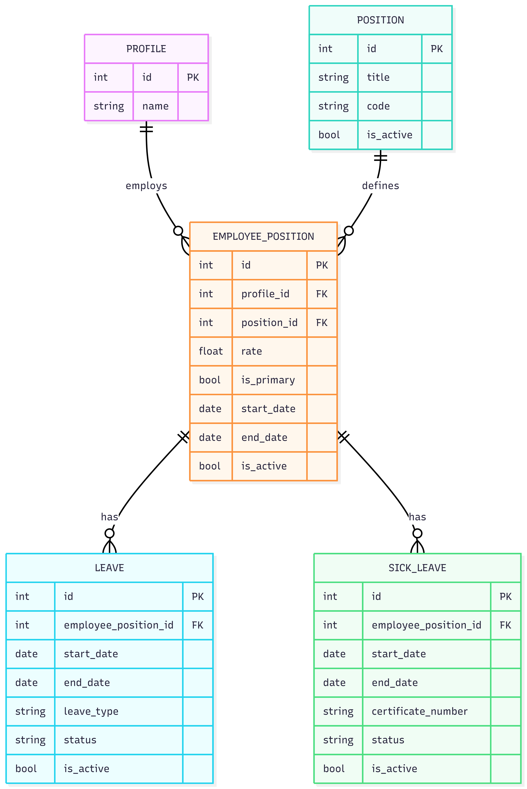

# Вариант 10: Employee Position & Leave Management Service (Сервис управления ставками и отпусками)

## Номер варианта и название сервиса
**Вариант 10**  
**Сервис:** «Управление ставками сотрудников, отпусками и больничными»  
Не хранит данные, которые точно будут в других сервисах (например, профили сотрудников, роли, аутентификация).

---

## ER-диаграмма (3НФ)

Диаграмма приведена в файле `erd.png`.  
Все таблицы находятся в **третьей нормальной форме (3НФ)**.  
Связь **многие ко многим** отсутствует в данной предметной области.  
Внешние ключи не принимают `NULL`.  
Мягкое удаление реализовано через поле `is_active`.

---

## Общие требования к API

### Возможные ошибки и коды ответов

| Код | Описание | Когда возникает |
| :--- | :--- | :--- |
| 400 Bad Request | Ошибка валидации входных данных | Неверный формат даты, недопустимое значение перечисления, нарушение ограничений полей |
| 404 Not Found | Сущность не найдена | Запрос по ID несуществующей или удалённой записи |
| 409 Conflict | Конфликт бизнес-логики | Пересечение периодов отпусков/больничных, дублирование уникальных полей |
| 500 Internal Server Error | Внутренняя ошибка сервера | Необработанное исключение |

### Правила мягкого удаления (Soft Delete)
Для всех сущностей удаление производится путём установки поля `is_active = False`.  
Метод возвращает `True` при успешном выполнении операции и `False`, если удаление невозможно (например, из-за связанных активных записей).

---

## 1. Справочник должностей (Position)

### Добавить должность

| Параметр | Пояснение | Обязательность | Тип | Ограничение | Значение по умолчанию |
| :--- | :--- | :--- | :--- | :--- | :--- |
| title | Название должности | Да | String | Макс. 255 символов | Нет |
| code | Код должности | Да | String | Уникальный среди активных, макс. 50 | Нет |
| department | Подразделение | Да | String | Макс. 100 символов | Нет |

**Уникальные комбинации параметров:**  
- `code` уникален среди активных записей.

**Возвращаемые данные при успешном создании:**

| Параметр | Тип |
| :--- | :--- |
| id | Integer |
| title | String |
| code | String |
| department | String |
| is_active | Boolean |
| created_at | DateTime |
| updated_at | DateTime |

### Изменить должность по ID

| Параметр | Обязательность | Тип | Ограничение |
| :--- | :--- | :--- | :--- |
| title | Нет | String | Макс. 255 символов |
| code | Нет | String | Уникальный среди активных |
| department | Нет | String | Макс. 100 символов |

**Возвращаемые данные при успешном изменении:**  
(те же, что при создании)

### Удалить должность по ID
Возвращает `True`, если запись помечена как `is_active = False`, иначе `False`.

### Получить должность по ID

| Параметр | Пояснение | Тип |
| :--- | :--- | :--- |
| id | ID | Integer |
| title | Название | String |
| code | Код | String |
| department | Подразделение | String |
| is_active | Активна | Boolean |

### Получить список должностей

**Параметры фильтрации:**

| Параметр | Пояснение | Обязательность | Тип |
| :--- | :--- | :--- | :--- |
| department | Фильтр по подразделению | Нет | String |
| is_active | Фильтр по активности | Нет | Boolean |

**Возвращаемые данные:** список объектов с полями `id`, `title`, `code`, `department`, `is_active`.

---

## 2. Ставка сотрудника (EmployeePosition)

### Добавить ставку

| Параметр | Пояснение | Обязательность | Тип | Ограничение |
| :--- | :--- | :--- | :--- | :--- |
| profile_id | ID профиля сотрудника | Да | Integer | Существующий профиль |
| position_id | ID должности | Да | Integer | Существующая должность |
| start_date | Дата начала | Да | Date | Не в будущем |
| end_date | Дата окончания | Нет | Date | >= start_date |
| rate | Коэф. ставки | Да | Decimal | [0.1 – 2.0] |
| is_primary | Основная | Нет | Boolean | false |

**Уникальные комбинации:**  
У одного сотрудника только одна активная основная ставка.

**Возвращаемые данные:**

| Параметр | Тип |
| :--- | :--- |
| id | Integer |
| profile_id | Integer |
| position_id | Integer |
| start_date | Date |
| end_date | Date |
| rate | Decimal |
| is_primary | Boolean |
| is_active | Boolean |

### Изменить ставку

| Параметр | Обязательность | Ограничение |
| :--- | :--- | :--- |
| position_id | Нет | Не менять при активных отпусках/больничных |
| start_date | Нет | Не в будущем |
| end_date | Нет | >= start_date |
| rate | Нет | [0.1 – 2.0] |
| is_primary | Нет | Сбрасывает предыдущую основную |

**Возвращаемые данные:** те же, что при создании.

### Удалить ставку
Soft delete через `is_active`.

### Получить ставку по ID и список

**Параметры фильтрации списка:**

| Параметр | Тип |
| :--- | :--- |
| profile_id | Integer |
| position_id | Integer |
| is_active | Boolean |
| is_primary | Boolean |

**Возвращается список объектов ставки.**

---

## 3. Отпуск (Leave)

### Добавить отпуск

| Параметр | Обязательность | Тип | Ограничение |
| :--- | :--- | :--- | :--- |
| employee_position_id | Да | Integer | Существующая ставка |
| start_date | Да | Date | Не в будущем |
| end_date | Да | Date | >= start_date |
| leave_type | Да | String | ANNUAL / UNPAID / STUDY |
| status | Нет | String | PLANNED / ACTIVE / COMPLETED / CANCELLED (по умолч. PLANNED) |

**Уникальные комбинации:**  
Период отпуска не пересекается с другими отпусками/больничными на той же ставке.

**Возвращаемые данные:**

| Параметр | Тип |
| :--- | :--- |
| id | Integer |
| employee_position_id | Integer |
| start_date | Date |
| end_date | Date |
| leave_type | String |
| status | String |
| is_active | Boolean |

### Изменить отпуск

| Параметр | Обязательность | Ограничение |
| :--- | :--- | :--- |
| start_date | Нет | Не в будущем |
| end_date | Нет | >= start_date |
| leave_type | Нет | ANNUAL / UNPAID / STUDY |
| status | Нет | PLANNED / ACTIVE / COMPLETED / CANCELLED |

### Удалить отпуск
Soft delete.

### Получить список отпусков

**Параметры фильтрации:**

| Параметр | Тип |
| :--- | :--- |
| employee_position_id | Integer |
| status | String |
| leave_type | String |
| date_from | Date |
| date_to | Date |

**Возвращается список объектов отпуска.**

---

## 4. Больничный (SickLeave)

### Добавить больничный

| Параметр | Обязательность | Тип | Ограничение |
| :--- | :--- | :--- | :--- |
| employee_position_id | Да | Integer | Существующая ставка |
| start_date | Да | Date | Не в будущем |
| end_date | Да | Date | >= start_date |
| certificate_number | Да | String | Уникальный среди активных, макс. 50 |
| status | Нет | String | OPEN / CLOSED / EXTENDED (по умолч. OPEN) |

**Уникальные комбинации:**  
- Период не пересекается с другими больничными/отпусками.  
- `certificate_number` уникален среди активных записей.

**Возвращаемые данные:**

| Параметр | Тип |
| :--- | :--- |
| id | Integer |
| employee_position_id | Integer |
| start_date | Date |
| end_date | Date |
| certificate_number | String |
| status | String |
| is_active | Boolean |

### Изменить больничный

| Параметр | Обязательность | Ограничение |
| :--- | :--- | :--- |
| start_date | Нет | Не в будущем |
| end_date | Нет | >= start_date |
| certificate_number | Нет | Уникальность |
| status | Нет | OPEN / CLOSED / EXTENDED |

### Удалить больничный
Soft delete.

### Получить список больничных

**Параметры фильтрации:**

| Параметр | Тип |
| :--- | :--- |
| employee_position_id | Integer |
| status | String |
| certificate_number | String |

**Возвращается список объектов больничного.**

---

## Модели БД (models.py)

В файле `models.py` будут реализованы следующие модели (Peewee):

- `Position`
- `EmployeePosition`
- `Leave`
- `SickLeave`

Поля:
- `is_active` (Boolean, по умолчанию True)
- `created_at`, `updated_at` (автоматически)

Все внешние ключи — `NOT NULL`.  
Связи:
- `EmployeePosition` → `Position`
- `Leave` → `EmployeePosition`
- `SickLeave` → `EmployeePosition`

Функция `init_db()` создаёт таблицы при запуске.  
Точка входа вызывает `init_db()`.

---

## Точки входа REST API (оценка 4)

Все методы используют FastAPI + Pydantic-валидацию.

| Метод | Эндпоинт | Описание |
| :--- | :--- | :--- |
| POST | `/positions/` | Создать должность |
| GET | `/positions/` | Список должностей |
| GET | `/positions/{id}` | Получить должность |
| PUT | `/positions/{id}` | Изменить должность |
| DELETE | `/positions/{id}` | Удалить (soft) |
| POST | `/employee-positions/` | Создать ставку |
| GET | `/employee-positions/` | Список ставок |
| PUT | `/employee-positions/{id}` | Изменить ставку |
| DELETE | `/employee-positions/{id}` | Удалить |
| POST | `/leaves/` | Создать отпуск |
| GET | `/leaves/` | Список отпусков |
| PUT | `/leaves/{id}` | Изменить отпуск |
| DELETE | `/leaves/{id}` | Удалить |
| POST | `/sick-leaves/` | Создать больничный |
| GET | `/sick-leaves/` | Список больничных |
| PUT | `/sick-leaves/{id}` | Изменить больничный |
| DELETE | `/sick-leaves/{id}` | Удалить |

---

## Стек технологий

- Python 3.8+
- Peewee (SQLite)
- FastAPI
- Pydantic + typing

---

## Структура отчёта (по требованиям)

Папка `S10` содержит:

- `doc.md` (данный файл)
- `erd.png`
- `models.py`
- `requirements.txt`
- `service.py` (на оценку 4)
- `client.py` (на оценку 5)
