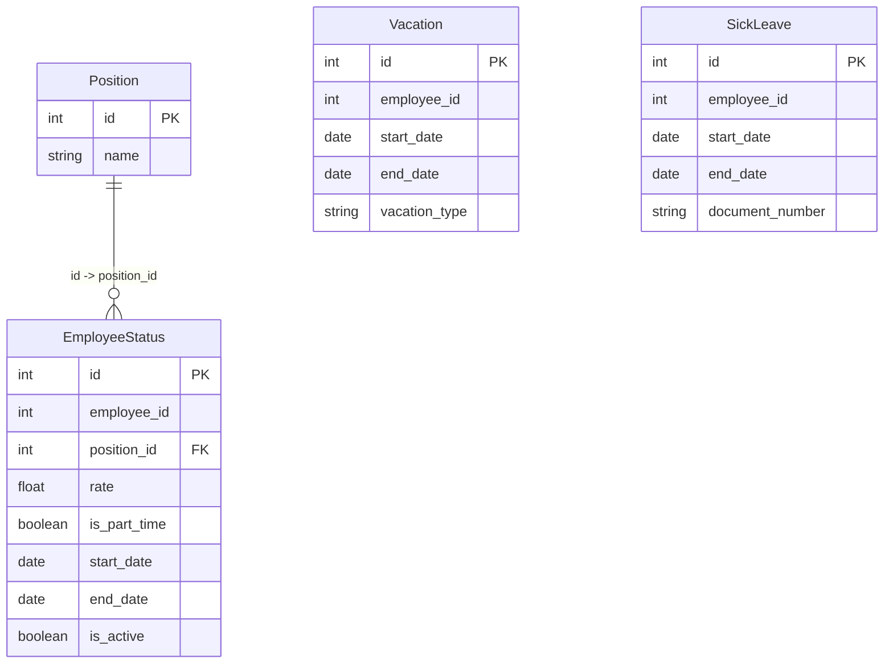

# Employee Status Service

## Назначение

Сервис хранит информацию о статусе сотрудников:

- должности;
- ставки;
- совместительство;
- отпуска;
- больничные.

Идентификатор сотрудника (`employee_id`) хранится как обычное поле.

---

## API

### Position

#### Создать должность

POST /positions

```json
{
  "name": "Преподаватель"
}
```

#### Получить список должностей

GET /positions

#### Получить должность по ID

GET /positions/{id}

#### Изменить должность

PUT /positions/{id}

#### Удалить должность

DELETE /positions/{id}

---

### Employee Status

#### Создать статус сотрудника

POST /employee-statuses

```json
{
  "employee_id": 10,
  "position_id": 1,
  "rate": 1.0,
  "is_part_time": false,
  "start_date": "2025-09-01",
  "end_date": null
}
```

#### Получить список статусов

GET /employee-statuses

#### Получить статус по ID

GET /employee-statuses/{id}

#### Изменить статус

PUT /employee-statuses/{id}

#### Удалить статус

DELETE /employee-statuses/{id}

---

### Vacation

#### Создать отпуск

POST /vacations

```json
{
  "employee_id": 10,
  "start_date": "2025-07-01",
  "end_date": "2025-07-28",
  "vacation_type": "annual"
}
```

#### Получить список отпусков

GET /vacations

#### Получить отпуск по ID

GET /vacations/{id}

#### Изменить отпуск

PUT /vacations/{id}

#### Удалить отпуск

DELETE /vacations/{id}

---

### Sick Leave

#### Создать больничный

POST /sick-leaves

```json
{
  "employee_id": 10,
  "start_date": "2025-10-10",
  "end_date": "2025-10-20",
  "document_number": "BL-12345"
}
```

#### Получить список больничных

GET /sick-leaves

#### Получить больничный по ID

GET /sick-leaves/{id}

#### Изменить больничный

PUT /sick-leaves/{id}

#### Удалить больничный

DELETE /sick-leaves/{id}

---

## ER-диаграмма


