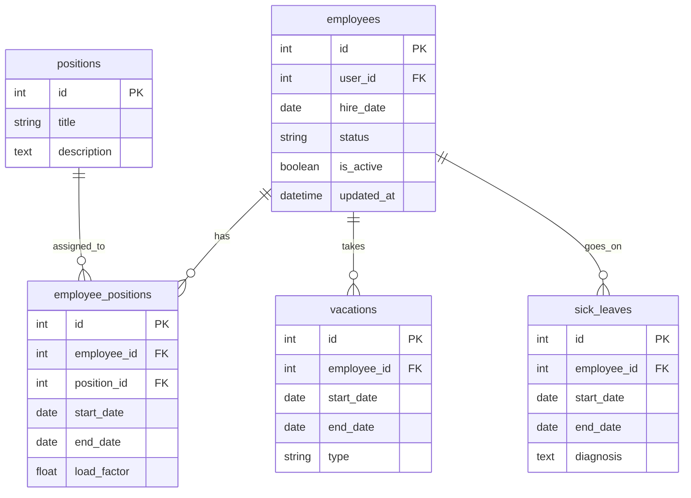

# Сервис статуса сотрудника (Employee Status Service) – Вариант 10

## Список функций
- `create_employee` – создание записи о сотруднике (только статусная информация)
- `update_employee` – изменение статусной информации сотрудника
- `delete_employee` – мягкое удаление (is_active = False)
- `get_employee` – получение сотрудника по ID
- `list_employees` – получение списка сотрудников с фильтрацией

> Примечание: ФИО, контакты и другие персональные данные хранятся в **Profile Service**. В данном сервисе используется `user_id` для связи с профилем.

---

## Сущность «Сотрудник»

### 1. Создание сотрудника

**Информация, требуемая для создания сотрудника**

| Параметр | Пояснение | Обязательность | Тип | Ограничение | Значение по умолчанию |
|----------|-----------|----------------|-----|-------------|-----------------------|
| `user_id` | ID сотрудника из Profile Service | Да | int | уникальный | – |
| `hire_date` | Дата найма | Да | date | не раньше 1900-01-01 | – |
| `status` | Текущий статус | Нет | string | active / on_vacation / sick_leave / fired | `'active'` |

**Информация, возвращаемая при успешном создании**

| Параметр | Пояснение | Тип |
|----------|-----------|-----|
| `id` | Внутренний ID записи | int |
| `user_id` | ID из Profile Service | int |
| `hire_date` | Дата найма | date |
| `status` | Текущий статус | string |
| `updated_at` | Дата и время создания/обновления | datetime |

---

### 2. Изменение сотрудника по ID (`update_employee`)

**Информация, требуемая для изменения** (все поля опциональны)

| Параметр | Пояснение | Обязательность | Тип | Ограничение | Значение по умолчанию |
|----------|-----------|----------------|-----|-------------|-----------------------|
| `hire_date` | Дата найма | Нет | date | не раньше 1900-01-01 | – |
| `status` | Статус | Нет | string | active / on_vacation / sick_leave / fired | – |

**Информация, возвращаемая при успешном изменении**

| Параметр | Пояснение | Тип |
|----------|-----------|-----|
| `id` | Внутренний ID записи | int |
| `user_id` | ID из Profile Service | int |
| `status` | Текущий статус | string |
| `updated_at` | Дата и время последнего обновления | datetime |

---

### 3. Удаление сотрудника по ID (`delete_employee`)

> Метод производит логическое (мягкое) удаление. Меняет значение флага `is_active` на `False`. Физического удаления записи из базы данных не происходит. Возвращает `True` при успешном изменении статуса, иначе `False`.

---

### 4. Получение сотрудника по ID (`get_employee`)

**Информация, возвращаемая при успешном поиске**

| Параметр | Пояснение | Тип |
|----------|-----------|-----|
| `id` | Внутренний ID записи | int |
| `user_id` | ID из Profile Service | int |
| `hire_date` | Дата найма | date |
| `status` | Текущий статус | string |
| `updated_at` | Дата и время последнего обновления | datetime |
| `positions` | Список должностей со структурой `[{"position_title": string, "start_date": string, "end_date": string, "load_factor": float}]` | list |

---

### 5. Получение списка сотрудников по заданным параметрам (`list_employees`)

**Параметры для получения списка**

| Параметр | Пояснение | Обязательность | Тип | Ограничение | Значение по умолчанию |
|----------|-----------|----------------|-----|-------------|-----------------------|
| `user_id` | ID сотрудника | Нет | int | точное совпадение | – |
| `status` | Статус | Нет | string | точное совпадение | – |
| `position_id` | Должность | Нет | int | фильтрация через транзитивную таблицу | – |
| `hire_date_from` | Дата найма от | Нет | date | диапазон (`>=`) | – |
| `hire_date_to` | Дата найма до | Нет | date | диапазон (`<=`) | – |
| `limit` | Лимит | Нет | int | максимум записей | `100` |
| `offset` | Смещение | Нет | int | для пагинации | – |

**Информация, возвращаемая в виде списка сотрудников** (каждый элемент)

| Параметр | Пояснение | Тип |
|----------|-----------|-----|
| `id` | Внутренний ID записи | int |
| `user_id` | ID из Profile Service | int |
| `hire_date` | Дата найма | date |
| `status` | Текущий статус | string |
| `position_ids`| Список ID должностей сотрудника (для прозрачности фильтрации) | list |

---

## ER-диаграмма

### Описание формирования сложных структур и связей

1. **Формирование параметра `positions` в `get_employee`**
   Сложная структура списка должностей формируется на основе объединения (JOIN) трех таблиц. Из таблицы `employee_positions` извлекаются периоды работы (`start_date`, `end_date`) и ставка (`load_factor`) для конкретного `employee_id`. Название должности (`position_title`) подтягивается из связанной таблицы `positions` по ключу `position_id`.

2. **Правила удаления и каскадность**
   Для всех зависимых сущностей (`employee_positions`, `vacations`, `sick_leaves`) настроено каскадное удаление на уровне базы данных (`ON DELETE CASCADE`). При физическом удалении записи сотрудника из таблицы `employees` или должности из таблицы `positions`, все связанные с ними исторические данные зачищаются автоматически.

3. **Связь с внешними сервисами**
   Поле `user_id` в таблице `employees` является внешним ключом (`FK`), указывающим на идентификатор пользователя в независимом внешнем микросервисе *Profile Service*.

4. **Формат дробных чисел**
   Поле `load_factor` в таблице `employee_positions` имеет тип `float` и хранит ставку сотрудника на должности с точностью до двух знаков после запятой (например, `0.5`, `1.0`).
