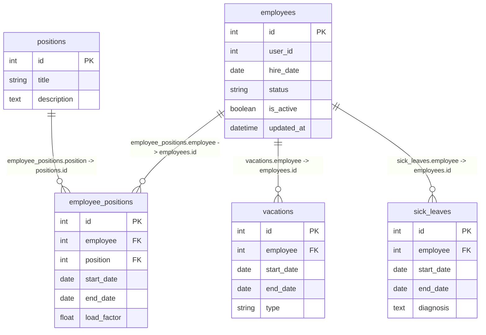

# Сервис статуса сотрудника (Employee Status Service) – Вариант 10

## Список функций
- `create_employee` – создание записи о сотруднике
- `update_employee` – изменение статусной информации сотрудника
- `delete_employee` – мягкое удаление (is_active = False)
- `get_employee` – получение сотрудника по ID
- `list_employees` – получение списка сотрудников с фильтрацией

> Примечание: ФИО, контакты и другие персональные данные хранятся в стороннем сервисе **Profile Service**. В данном сервисе используется исключительно `user_id` для связи с профилем. Полноценных реляционных связей на уровне БД данного сервиса по этому полю нет.

---

## Сущность «Сотрудник»

### 1. Создание сотрудника (`create_employee`)

**Информация, требуемая для создания сотрудника**

| Параметр | Пояснение | Обязательность | Тип | Ограничение | Значение по умолчанию |
|----------|-----------|----------------|-----|-------------|-----------------------|
| `user_id` | Внешний ID из Profile Service (без Foreign Key в БД) | Да | int | уникальный | – |
| `hire_date` | Дата найма | Да | date | не раньше 1900-01-01 | – |
| `status` | Текущий статус | Нет | string | active / on_vacation / sick_leave / fired | `'active'` |

**Уникальные комбинации:** `user_id` (глобально уникален)

**Информация, возвращаемая при успешном создании**

| Параметр | Тип |
|----------|-----|
| `id` | int |
| `user_id` | int |
| `hire_date` | date |
| `status` | string |

---

### 2. Изменение сотрудника по ID (`update_employee`)

**Информация, требуемая для изменения** (все поля опциональны)

| Параметр | Пояснение | Обязательность | Тип | Ограничение | Значение по умолчанию |
|----------|-----------|----------------|-----|-------------|-----------------------|
| `hire_date` | Дата найма | Нет | date | не раньше 1900-01-01 | – |
| `status` | Статус | Нет | string | active / on_vacation / sick_leave / fired | – |

**Информация, возвращаемая при успешном изменении**

| Параметр | Тип |
|----------|-----|
| `id` | int |
| `user_id` | int |
| `status` | string |

---

### 3. Удаление сотрудника по ID (`delete_employee`)

> Метод производит логическое (мягкое) удаление сотрудника. Изменяет значение флага `is_active` на `False` (по умолчанию `True`). Физического удаления из БД не происходит. Возвращает `True`, если статус был успешно изменен, иначе `False`.

---

### 4. Получение сотрудника по ID (`get_employee`)

**Информация, возвращаемая при успешном поиске**

| Параметр | Пояснение | Тип |
|----------|-----------|-----|
| `id` | Внутренний ID записи | int |
| `user_id` | Внешний ID из Profile Service | int |
| `hire_date` | Дата найма | date |
| `status` | Текущий статус | string |

---

### 5. Получение списка сотрудников по заданным параметрам (`list_employees`)

**Параметры для получения списка**

| Параметр (англ.) | Пояснение | Тип |
|----------|-----------|-----|
| `user_id` | ID сотрудника для точного совпадения | int |
| `status` | Статус для точного совпадения | string |
| `position_id` | Должность для фильтрации через транзитивную таблицу | int |
| `hire_date_from` | Дата найма от (диапазон `>=`) | date |
| `hire_date_to` | Дата найма до (диапазон `<=`) | date |
| `limit` | Лимит максимум записей (default 100) | int |
| `offset` | Смещение для пагинации | int |

**Информация, возвращаемая в виде списка сотрудников** (каждый элемент)

| Параметр | Пояснение | Тип |
|----------|-----------|-----|
| `id` | Внутренний ID записи | int |
| `user_id` | Внешний ID из Profile Service | int |
| `hire_date` | Дата найма | date |
| `status` | Текущий статус | string |
| `position_ids` | Массив ID должностей сотрудника, агрегированный из транзитивной таблицы | list |

---

## Дополнительное описание API сопутствующих таблиц

### 6. Таблица Должностей (`positions`)
- **Добавить**: Принимает `title` (string), `description` (text). Возвращает созданный объект должности.
- **Изменить**: Принимает `id` (int), обновляет `title` и `description`. Возвращает измененный объект.
- **Удалить**: Принимает `id` (int). Удаляет запись из БД. Возвращает булево значение.
- **Получить по ID**: Принимает `id` (int). Возвращает данные должности (`id`, `title`, `description`).
- **Получить список**: Принимает `limit` и `offset`. Возвращает массив должностей.

### 7. Транзитивная таблица назначений (`employee_positions`)
- **Добавить**: Принимает `employee` (int), `position` (int), `start_date` (date), `end_date` (date), `load_factor` (float). Возвращает объект связи.
- **Изменить**: Принимает `id` (int) и новые параметры дат или ставки. Возвращает обновленный объект.
- **Удалить**: Принимает `id` (int). Разрывает связь. Возвращает булево значение.
- **Получить по ID**: Принимает `id` (int). Возвращает объект связи.
- **Получить список**: Фильтр по `employee` или `position`. Возвращает массив назначений.

### 8. Логирование отпусков (`vacations`)
- **Добавить**: Принимает `employee` (int), `start_date` (date), `end_date` (date), `type` (string). Возвращает запись отпуска.
- **Изменить**: Принимает `id` (int), обновляет периоды или тип. Возвращает измененную запись.
- **Удалить**: Принимает `id` (int). Возвращает булево значение.
- **Получить по ID**: Принимает `id` (int). Возвращает запись отпуска.
- **Получить список**: Фильтр по `employee`. Возвращает историю отпусков сотрудника.

### 9. Логирование больничных (`sick_leaves`)
- **Добавить**: Принимает `employee` (int), `start_date` (date), `end_date` (date), `diagnosis` (text). Возвращает запись больничного.
- **Изменить**: Принимает `id` (int), обновляет периоды или диагноз. Возвращает измененную запись.
- **Удалить**: Принимает `id` (int). Возвращает булево значение.
- **Получить по ID**: Принимает `id` (int). Возвращает запись больничного.
- **Получить список**: Фильтр по `employee`. Возвращает историю больничных сотрудника.

---

## ER-диаграмма

### Список реляционных связей
- `employee_positions.employee -> employees.id` (Связь транзитивной таблицы назначений с сущностью сотрудников)
- `employee_positions.position -> positions.id` (Связь транзитивной таблицы назначений со справочником должностей)
- `vacations.employee -> employees.id` (Связь логирования отпусков со справочником сотрудников)
- `sick_leaves.employee -> employees.id` (Связь логирования больничных листов со справочником сотрудников)

---

## Обоснование соответствия третьей нормальной форме (3НФ)
Проектируемая реляционная база данных полностью удовлетворяет критериям 3НФ по следующим причинам:
1. **1НФ**: Все атрибуты во всех таблицах атомарны (массивы, списки или сложные структуры отсутствуют, значения неделимы).
2. **2НФ**: База данных находится в 1НФ, и все неключевые атрибуты полностью зависят от составных или простых первичных ключей (`id`). В транзитивной таблице `employee_positions` неключевые поля `start_date`, `end_date` и `load_factor` характеризуют конкретный факт назначения сотрудника на должность, то есть зависят от суррогатного PK данной таблицы целиком.
3. **3НФ**: База данных находится во 2НФ, и в ней отсутствуют транзитивные зависимости неключевых полей от других неключевых полей. Изменение статусной информации в `employees`, логирование периодов в `vacations` или `sick_leaves` зависят строго от первичных ключей соответствующих таблиц и не детерминируют друг друга.
