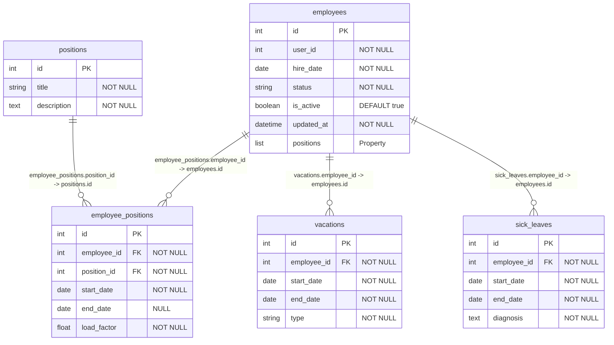

# Сервис статуса сотрудника (Employee Status Service) – Вариант 10

## Список функций
- `create_employee` – создание записи о сотруднике
- `update_employee` – изменение статусной информации сотрудника
- `delete_employee` – мягкое удаление (is_active = False)
- `get_employee` – получение сотрудника по ID
- `list_employees` – получение списка сотрудников с фильтрацией и пагинацией

---

## Сущность «Сотрудник»

### 1. Создание сотрудника (`create_employee`)

**Информация, требуемая для создания сотрудника**

| Параметр | Пояснение | Обязательность | Тип | Ограничение | Значение по умолчанию |
|----------|-----------|----------------|-----|-------------|-----------------------|
| `user_id` | ID сотрудника из Profile Service | Да | int | уникальный | – |
| `hire_date` | Дата найма | Да | date | не раньше 1900-01-01 | – |
| `status` | Текущий статус | Нет | string | active / on_vacation / sick_leave / fired | `'active'` |

**Уникальные комбинации:** `user_id` (глобально уникален)

**Информация, возвращаемая при успешном создании**

| Параметр | Пояснение | Тип |
|----------|-----------|-----|
| `id` | Внутренний ID записи (PK) | int |
| `user_id` | ID из Profile Service | int |
| `hire_date` | Дата найма | date |
| `status` | Текущий статус | string |
| `updated_at` | Дата и время создания | datetime |

---

### 2. Изменение сотрудника по ID (`update_employee`)

**Информация, требуемая для изменения** (все поля опциональны)

| Параметр | Пояснение | Обязательность | Тип | Ограничение | Значение по умолчанию |
|----------|-----------|----------------|-----|-------------|-----------------------|
| `hire_date` | Дата найма | Нет | date | не раньше 1900-01-01 | – |
| `status` | Статус | Нет | string | active / on_vacation / sick_leave / fired | – |

**Информация, возвращаемая при успешном изменении**

| Параметр | Пояснение | Тип |
|----------|-----------|-----|
| `id` | Внутренний ID записи | int |
| `user_id` | ID из Profile Service | int |
| `hire_date` | Дата найма | date |
| `status` | Текущий статус | string |
| `updated_at` | Дата и время последнего обновления | datetime |

---

### 3. Удаление сотрудника по ID (`delete_employee`)

> Метод производит логическое (мягкое) удаление путем перевода флага `is_active` в `False`. Физического зачищения строк в БД не происходит.

**Возвращаемое значение:** `True / False` (bool)

---

### 4. Получение сотрудника по ID (`get_employee`)

**Информация, возвращаемая при успешном поиске**

| Параметр | Пояснение | Тип | Ограничение |
|----------|-----------|-----|-------------|
| `id` | Внутренний ID записи | int | PK |
| `user_id` | ID из Profile Service | int | unique |
| `hire_date` | Дата найма | date | >= 1900-01-01 |
| `status` | Текущий статус | string | active / on_vacation / sick_leave / fired |
| `is_active` | Статус активности записи | boolean | – |
| `updated_at` | Дата и время последнего обновления | datetime | – |
| `positions` | Список должностей (вычисляемая структура) | list | структура `[{"position_title": string, "start_date": string, "end_date": string, "load_factor": float}]` |

---

### 5. Получение списка сотрудников по заданным параметрам (`list_employees`)

**Параметры для получения списка**

| Параметр | Пояснение | Обязательность | Тип | Ограничение | Значение по умолчанию |
|----------|-----------|----------------|-----|-------------|-----------------------|
| `user_id` | ID сотрудника | Нет | int | точное совпадение | – |
| `status` | Статус | Нет | string | точное совпадение | – |
| `position_id` | Должность | Нет | int | фильтрация через транзитивную таблицу | – |
| `hire_date_from` | Дата найма от | Нет | date | диапазон (`>=`) | – |
| `hire_date_to` | Дата найма до | Нет | date | диапазон (`<=`) | – |
| `limit` | Лимит записей | Нет | int | пагинация | `100` |
| `offset` | Смещение | Нет | int | для пагинации | – |

**Информация, возвращаемая в виде списка сотрудников**

| Параметр | Пояснение | Тип |
|----------|-----------|-----|
| `id` | Внутренний ID записи | int |
| `user_id` | ID из Profile Service | int |
| `hire_date` | Дата найма | date |
| `status` | Текущий статус | string |
| `is_active` | Статус активности записи | boolean |
| `position_id` | Идентификатор должности. Получается через подзапрос / JOIN транзитивной таблицы `employee_positions` по условию соответствия `employee_id`. | int |

---

## Дополнительное описание API сопутствующих таблиц

### 6. Управление должностями (`positions`)
- **Добавить**: Принимает `title` (string, max 100), `description` (text). Возвращает созданный объект `Position`.
- **Изменить**: Принимает `id` (int) и опционально изменяемые поля `title`, `description`. Возвращает обновленный `Position`.
- **Удалить**: Принимает `id` (int). Возвращает `True / False`.
- **Получить по ID**: Принимает `id` (int). Возвращает `Position` со всеми полями.
- **Получить список**: Принимает `limit` (int) и `offset` (int). Возвращает массив объектов `Position`.

### 7. Управление назначениями (`employee_positions`)
- **Добавить**: Принимает `employee_id` (int), `position_id` (int), `start_date` (date), `end_date` (date, null), `load_factor` (float). Возвращает созданную связь.
- **Изменить**: Принимает `id` (int) и изменяемые параметры периода или ставки. Возвращает обновленную связь.
- **Удалить**: Принимает `id` (int). Возвращает `True / False`.
- **Получить по ID**: Принимает `id` (int). Возвращает объект связи.
- **Получить список**: Принимает `employee_id` или `position_id`. Возвращает список связей.

### 8. Логирование отпусков (`vacations`)
- **Добавить**: Принимает `employee_id` (int), `start_date` (date), `end_date` (date), `type` (string). Возвращает объект отпуска.
- **Изменить**: Принимает `id` (int), изменяет даты или тип. Возвращает обновленный объект.
- **Удалить**: Принимает `id` (int). Возвращает `True / False`.
- **Получить по ID**: Принимает `id` (int). Возвращает запись отпуска.
- **Получить список**: Фильтр по `employee_id`. Возвращает историю отпусков сотрудника.

### 9. Логирование больничных (`sick_leaves`)
- **Добавить**: Принимает `employee_id` (int), `start_date` (date), `end_date` (date), `diagnosis` (text). Возвращает объект больничного.
- **Изменить**: Принимает `id` (int), изменяет даты или диагноз. Возвращает обновленный объект.
- **Удалить**: Принимает `id` (int). Возвращает `True / False`.
- **Получить по ID**: Принимает `id` (int). Возвращает запись больничного.
- **Получить список**: Фильтр по `employee_id`. Возвращает историю больничных сотрудника.

---

## ER-диаграмма

### Список реляционных связей
- Связь между таблицами **`employees`** и **`employee_positions`** осуществляется по полям: `employee_positions.employee_id` (int, FK) ➔ `employees.id` (int, PK).
- Связь между таблицами **`positions`** и **`employee_positions`** осуществляется по полям: `employee_positions.position_id` (int, FK) ➔ `positions.id` (int, PK).
- Связь между таблицами **`employees`** и **`vacations`** осуществляется по полям: `vacations.employee_id` (int, FK) ➔ `employees.id` (int, PK).
- Связь между таблицами **`employees`** и **`sick_leaves`** осуществляется по полям: `sick_leaves.employee_id` (int, FK) ➔ `employees.id` (int, PK).
