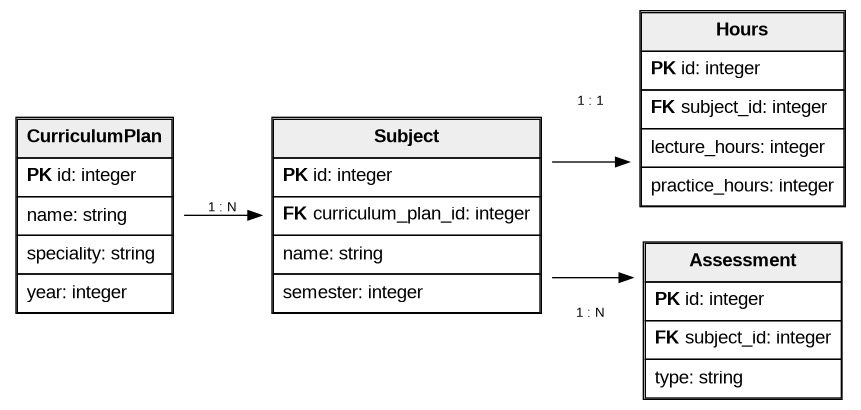

### Вариант №12. Сервис учебного плана (Curriculum Plan)

#### Создание учебного плана

Информация требуемая для создания учебного плана

| Параметр | Обязательность | Тип | Ограничение | Значение по умолчанию |
|----------|----------------|-----|-------------|-----------------------|
| name | Обязательно | Строка | Не пустое | — |
| speciality | Обязательно | Строка | Не пустое | — |
| year | Обязательно | Целое | Больше 2000 | — |

Выходные данные

| Параметр | Тип |
|----------|-----|
| id | Целое |
| name | Строка |
| speciality | Строка |
| year | Целое |

#### Добавление дисциплины в учебный план

Входные параметры

| Параметр | Обязательность | Тип | Ограничение | Значение по умолчанию |
|----------|----------------|-----|-------------|-----------------------|
| curriculum_plan_id | Обязательно | Целое | Существует в БД | — |
| name | Обязательно | Строка | Не пустое | — |
| semester | Обязательно | Целое | От 1 до 12 | — |

Выходные данные

| Параметр | Тип |
|----------|-----|
| id | Целое |
| curriculum_plan_id | Целое |
| name | Строка |
| semester | Целое |

#### Добавление часов по дисциплине

Входные параметры

| Параметр | Обязательность | Тип | Ограничение | Значение по умолчанию |
|----------|----------------|-----|-------------|-----------------------|
| subject_id | Обязательно | Целое | Существует в БД | — |
| lecture_hours | Обязательно | Целое | Не меньше 0 | 0 |
| practice_hours | Обязательно | Целое | Не меньше 0 | 0 |

Выходные данные

| Параметр | Тип |
|----------|-----|
| id | Целое |
| subject_id | Целое |
| lecture_hours | Целое |
| practice_hours | Целое |

#### Добавление формы контроля

Входные параметры

| Параметр | Обязательность | Тип | Ограничение | Значение по умолчанию |
|----------|----------------|-----|-------------|-----------------------|
| subject_id | Обязательно | Целое | Существует в БД | — |
| type | Обязательно | Строка | Экзамен или зачет | — |

Выходные данные

| Параметр | Тип |
|----------|-----|
| id | Целое |
| subject_id | Целое |
| type | Строка |

#### Получение учебного плана

Входные параметры

| Параметр | Обязательность | Тип | Ограничение | Значение по умолчанию |
|----------|----------------|-----|-------------|-----------------------|
| curriculum_plan_id | Обязательно | Целое | Существует в БД | — |

Выходные данные

| Параметр | Тип | Описание |
|----------|-----|----------|
| id | Целое | Идентификатор учебного плана |
| name | Строка | Название учебного плана |
| speciality | Строка | Специальность |
| year | Целое | Год начала обучения |
| subjects | Список | Список дисциплин с семестром, часами и формой контроля |

### ER-диаграмма
