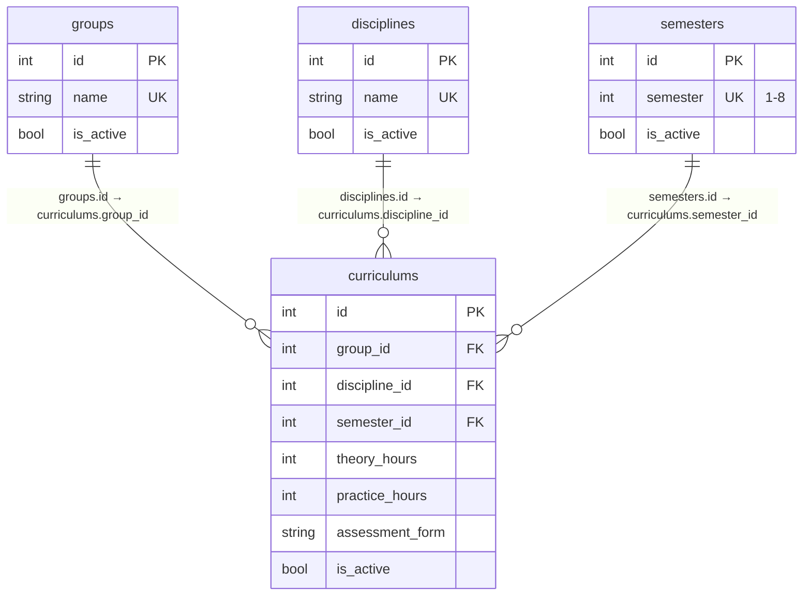

# Вариант №12. Curriculum Plan Service

## ER-диаграмма и список связей

**Обоснование нормализации**: База данных спроектирована и приведена к Третьей нормальной форме (3НФ). Все таблицы содержат только атомарные атрибуты, каждый неключевой показатель полностью зависит от первичного ключа (1НФ, 2НФ), и в структуре полностью отсутствуют транзитивные зависимости между неключевыми полями (3НФ).

### Список реляционных связей:
- `semesters.id` → `curriculums.semester_id`

---

## Описание API

### Group

#### 1. Добавить сущность (Group)
**Входные данные (для создания):**

| Параметр (англ.) | Пояснение | Обязательность | Тип | Ограничение | Значение по умолчанию |
| :--- | :--- | :--- | :--- | :--- | :--- |
| name | Название группы | Да | string | unique, max_length=100 | — |
| is_active | Статус активности записи | Нет | bool | — | true |

* **Уникальные комбинации параметров**: `name`

**Выходные данные (при успешном ответе):**

| Параметр (англ.) | Тип |
| :--- | :--- |
| id | int |
| name | string |
| is_active | bool |

#### 2. Изменить сущность по ID (Group)
**Входные данные (для изменения):**

| Параметр (англ.) | Пояснение | Обязательность | Тип | Ограничение |
| :--- | :--- | :--- | :--- | :--- |
| name | Новое название группы | Нет | string | unique, max_length=100 |
| is_active | Восстановление/деактивация записи | Нет | bool | — |

**Выходные данные (при успешном изменении):**

| Параметр (англ.) | Тип |
| :--- | :--- |
| id | int |
| name | string |
| is_active | bool |

#### 3. Удалить сущность по ID (Group)
* **Логика**: Реализует мягкое удаление (логическое). При удалении поле `is_active` устанавливается в значение `false`.

**Выходные данные:**

| Параметр (англ.) | Тип |
| :--- | :--- |
| success | bool |

#### 4. Получить сущность по ID (Group)
**Выходные данные:**

| Параметр (англ.) | Пояснение | Тип |
| :--- | :--- | :--- |
| id | ID группы | int |
| name | Название группы | string |
| is_active | Активна ли группа | bool |

#### 5. Получить список сущностей по заданным параметрам (Group)
**Параметры запроса:**

| Параметр (англ.) | Пояснение | Тип |
| :--- | :--- | :--- |
| id | Фильтр по ID группы | int |
| name | Фильтр по названию группы | string |
| is_active | Фильтр по активности | bool |

**Возвращаемый список:**

| Параметр (англ.) | Тип |
| :--- | :--- |
| id | int |
| name | string |
| is_active | bool |

---

### Discipline

#### 1. Добавить сущность (Discipline)
**Входные данные (для создания):**

| Параметр (англ.) | Пояснение | Обязательность | Тип | Ограничение | Значение по умолчанию |
| :--- | :--- | :--- | :--- | :--- | :--- |
| name | Название дисциплины | Да | string | unique, max_length=200 | — |
| is_active | Статус активности записи | Нет | bool | — | true |

* **Уникальные комбинации параметров**: `name`

**Выходные данные (при успешном ответе):**

| Параметр (англ.) | Тип |
| :--- | :--- |
| id | int |
| name | string |
| is_active | bool |

#### 2. Изменить сущность по ID (Discipline)
**Входные данные (для изменения):**

| Параметр (англ.) | Пояснение | Обязательность | Тип | Ограничение |
| :--- | :--- | :--- | :--- | :--- |
| name | Новое название дисциплины | Нет | string | unique, max_length=200 |
| is_active | Восстановление/деактивация записи | Нет | bool | — |

**Выходные данные (при успешном изменении):**

| Параметр (англ.) | Тип |
| :--- | :--- |
| id | int |
| name | string |
| is_active | bool |

#### 3. Удалить сущность по ID (Discipline)
* **Логика**: Реализует мягкое удаление (логическое). При удалении поле `is_active` устанавливается в значение `false`.

**Выходные данные:**

| Параметр (англ.) | Тип |
| :--- | :--- |
| success | bool |

#### 4. Получить сущность по ID (Discipline)
**Выходные данные:**

| Параметр (англ.) | Пояснение | Тип |
| :--- | :--- | :--- |
| id | ID дисциплины | int |
| name | Название дисциплины | string |
| is_active | Активна ли дисциплина | bool |

#### 5. Получить список сущностей по заданным параметрам (Discipline)
**Параметры запроса:**

| Параметр (англ.) | Пояснение | Тип |
| :--- | :--- | :--- |
| id | Фильтр по ID дисциплины | int |
| name | Фильтр по названию дисциплины | string |
| is_active | Фильтр по активности | bool |

**Возвращаемый список:**

| Параметр (англ.) | Тип |
| :--- | :--- |
| id | int |
| name | string |
| is_active | bool |
### Semester

#### 1. Добавить сущность (Semester)
**Входные данные (для создания):**

| Параметр (англ.) | Пояснение | Обязательность | Тип | Ограничение | Значение по умолчанию |
| :--- | :--- | :--- | :--- | :--- | :--- |
| semester | Номер семестра | Да | int | Уникальный в рамках учебного года (от 1 до 8) | — |
| is_active | Статус активности записи | Нет | bool | — | true |

* **Уникальные комбинации параметров**: `semester`

**Выходные данные (при успешном ответе):**

| Параметр (англ.) | Тип |
| :--- | :--- |
| id | int |
| semester | int |
| is_active | bool |

#### 2. Изменить сущность по ID (Semester)
**Входные данные (для изменения):**

| Параметр (англ.) | Пояснение | Обязательность | Тип | Ограничение |
| :--- | :--- | :--- | :--- | :--- |
| semester | Новый номер семестра | Нет | int | Уникальный в рамках учебного года (от 1 до 8) |
| is_active | Восстановление/деактивация записи | Нет | bool | — |

**Выходные данные (при успешном изменении):**

| Параметр (англ.) | Тип |
| :--- | :--- |
| id | int |
| semester | int |
| is_active | bool |

#### 3. Удалить сущность по ID (Semester)
* **Логика**: Реализует мягкое удаление (логическое). При удалении поле `is_active` устанавливается в значение `false`.

**Выходные данные:**

| Параметр (англ.) | Тип |
| :--- | :--- |
| success | bool |

#### 4. Получить сущность по ID (Semester)
**Выходные данные:**

| Параметр (англ.) | Пояснение | Тип |
| :--- | :--- | :--- |
| id | ID семестра | int |
| semester | Номер семестра | int |
| is_active | Активен ли семестр | bool |

#### 5. Получить список сущностей по заданным параметрам (Semester)
**Параметры запроса:**

| Параметр (англ.) | Пояснение | Тип |
| :--- | :--- | :--- |
| id | Фильтр по ID семестра | int |
| semester | Фильтр по номеру семестра | int |
| is_active | Фильтр по активности | bool |

**Возвращаемый список:**

| Параметр (англ.) | Тип |
| :--- | :--- |
| id | int |
| semester | int |
| is_active | bool |

---

### Curriculum

#### 1. Добавить сущность (Curriculum)
**Входные данные (для создания):**

| Параметр (англ.) | Пояснение | Обязательность | Тип | Ограничение | Значение по умолчанию |
| :--- | :--- | :--- | :--- | :--- | :--- |
| group_id | ID академической группы | Да | int | Больше 0 | — |
| discipline_id | ID учебной дисциплины | Да | int | Больше 0 | — |
| semester_id | ID записи семестра | Да | int | Больше 0 | — |
| theory_hours | Часы теории | Да | int | Неотрицательное (>= 0) | — |
| practice_hours | Часы практики | Да | int | Неотрицательное (>= 0) | — |
| assessment_form | Форма контроля | Да | string | exam / credit | — |
| is_active | Статус активности записи | Нет | bool | — | true |

* **Уникальные комбинации параметров**: `group_id` + `discipline_id` + `semester_id`

**Выходные данные (при успешном ответе):**

| Параметр (англ.) | Тип |
| :--- | :--- |
| id | int |
| group_id | int |
| discipline_id | int |
| semester_id | int |
| theory_hours | int |
| practice_hours | int |
| assessment_form | string |
| is_active | bool |

#### 2. Изменить сущность по ID (Curriculum)
**Входные данные (для изменения):**

| Параметр (англ.) | Пояснение | Обязательность | Тип | Ограничение |
| :--- | :--- | :--- | :--- | :--- |
| group_id | ID академической группы | Нет | int | — |
| discipline_id | ID учебной дисциплины | Нет | int | — |
| semester_id | ID записи семестра | Нет | int | — |
| theory_hours | Новые часы теории | Нет | int | Неотрицательное (>= 0) |
| practice_hours | Новые часы практики | Нет | int | Неотрицательное (>= 0) |
| assessment_form | Новая форма контроля | Нет | string | exam / credit |
| is_active | Восстановление/деактивация записи | Нет | bool | — |

**Выходные данные (при успешном изменении):**

| Параметр (англ.) | Тип |
| :--- | :--- |
| id | int |
| group_id | int |
| discipline_id | int |
| semester_id | int |
| theory_hours | int |
| practice_hours | int |
| assessment_form | string |
| is_active | bool |

#### 3. Удалить сущность по ID (Curriculum)
* **Логика**: Реализует мягкое удаление (логическое). При удалении поле `is_active` устанавливается в значение `false`.

**Выходные данные:**

| Параметр (англ.) | Тип |
| :--- | :--- |
| success | bool |

#### 4. Получить сущность по ID (Curriculum)
**Выходные данные:**

| Параметр (англ.) | Пояснение | Тип |
| :--- | :--- | :--- |
| id | ID записи учебного плана | int |
| group_id | ID группы | int |
| discipline_id | ID дисциплины | int |
| semester_id | ID семестра | int |
| theory_hours | Часы теории | int |
| practice_hours | Часы практики | int |
| assessment_form | Форма отчетности | string |
| is_active | Активна ли запись | bool |

#### 5. Получить список сущностей по заданным параметрам (Curriculum)
**Параметры запроса:**

| Параметр (англ.) | Пояснение | Тип |
| :--- | :--- | :--- |
| id | Фильтр по ID записи плана | int |
| group_id | Фильтр по ID группы | int |
| discipline_id | Фильтр по ID дисциплины | int |
| semester_id | Фильтр по ID семестра | int |
| theory_hours | Фильтр по точному количеству часов теории | int |
| practice_hours | Фильтр по точному количеству часов практики | int |
| assessment_form | Фильтр по форме отчетности | string |
| is_active | Фильтр по активности | bool |

**Логика выборки и возможные комбинации фильтров:**
Выборка элементов осуществляется по принципу логического «И» (AND) между всеми переданными параметрами запроса. Допустимы следующие сценарии использования:
1. **Поиск конкретной записи**: Передается только параметр `id`.
2. **Получение учебного плана конкретной группы**: Передается параметр `group_id` отдельно или совместно с `semester_id` (для фильтрации по семестрам).
3. **Анализ нагрузки по предмету**: Передается параметр `discipline_id` совместно с `theory_hours` или `practice_hours` для поиска записей с определенной почасовой нагрузкой.
4. **Фильтрация по форме контроля**: Параметр `assessment_form` комбинируется с `group_id` или `semester_id` для выявления всех экзаменов/зачетов группы в семестре.
