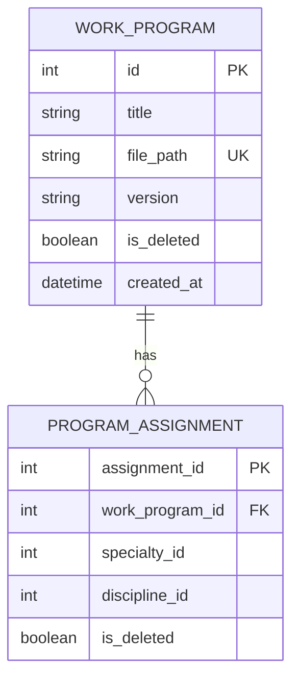

# Вариант №13. Work Program Service (Сервис рабочих программ)

---

## ER-диаграмма в doc.md (Mermaid)

### Список реляционных связей в которых указано, какие поля из каких таблиц связываются:
* Поле `work_program_id` (заданное в коде через `column_name='work_program_id'`) из транзитивной таблицы `PROGRAM_ASSIGNMENT` связывается с полем `id` из главной таблицы `WORK_PROGRAM`.

---

## Описание API для таблицы WorkProgram (Рабочая программа)

### 1. Добавить сущность

**Информация для создания (таблица):**

| Параметр (англ.) | Пояснение | Обязательность | Тип | Ограничение | Значение по умолчанию |
| :--- | :--- | :--- | :--- | :--- | :--- |
| title | Название программы | Да | string | Not NULL | — |
| file_path | Путь к файлу на сервере | Да | string | Not NULL, уникальный | — |
| version | Версия документа | Да | string | Not NULL, формат x.x | "1.0" |

**Уникальные комбинации параметров (если есть) — перечислить:**
* `(title, version)` — в системе не может быть двух программ с одинаковым названием и одинаковой версией.
* `file_path` — путь к файлу должен быть уникальным.

**Информация при успешном создании (таблица):**

| Параметр (англ.) | Тип |
| :--- | :--- |
| id | int |
| title | string |
| file_path | string |
| version | string |
| is_deleted | boolean |
| created_at | datetime |

### 2. Изменить сущность по ID

**Информация для изменения (таблица):**

| Параметр (англ.) | Пояснение | Обязательность | Тип | Ограничение |
| :--- | :--- | :--- | :--- | :--- |
| title | Название программы | Нет | string | Not NULL |
| file_path | Путь к файлу на сервере | Нет | string | Not NULL, уникальный |
| version | Версия документа | Нет | string | Not NULL, формат x.x |

**Информация при успешном изменении (таблица):**

| Параметр (англ.) | Тип |
| :--- | :--- |
| id | int |
| title | string |
| file_path | string |
| version | string |

### 3. Удалить сущность по ID
Реализовано мягкое удаление. При вызове удаления поле `is_deleted` у программы устанавливается в `True`, а также каскадно переводится в значение `True` для всех связанных назначений в таблице `ProgramAssignment`.
* **Возвращаемое значение:** `true` (если запись найдена и помечена удалённой), иначе `false`.

### 4. Получить сущность по ID

**Возвращаемая информация (таблица):**

| Параметр (англ.) | Пояснение | Тип |
| :--- | :--- | :--- |
| id | Идентификатор программы | int |
| title | Название программы | string |
| file_path | Путь к файлу на сервере | string |
| version | Версия документа | string |
| is_deleted | Флаг мягкого удаления | boolean |
| created_at | Дата и время создания | datetime |

### 5. Получить список сущностей по заданным параметрам

**Параметры запроса (таблица):**

| Параметр (англ.) | Пояснение | Тип |
| :--- | :--- | :--- |
| version | Фильтр по точной версии программы | string |

**Возвращаемый список (таблица с полями сущности):**

| Параметр (англ.) | Тип |
| :--- | :--- |
| id | int |
| title | string |
| file_path | string |
| version | string |

---

## Описание API для таблицы ProgramAssignment (Назначение программы)

### 1. Добавить сущность

**Информация для создания (таблица):**

| Параметр (англ.) | Пояснение | Обязательность | Тип | Ограничение | Значение по умолчанию |
| :--- | :--- | :--- | :--- | :--- | :--- |
| work_program_id | ID связанной рабочей программы | Да | int | Foreign Key | — |
| specialty_id | ID внешней специальности | Да | int | Not NULL | — |
| discipline_id | ID внешней дисциплины | Да | int | Not NULL | — |

**Уникальные комбинации параметров (если есть) — перечислить:**
* `(work_program_id, specialty_id, discipline_id)` — исключает создание дублирующих связей.

**Информация при успешном создании (таблица):**

| Параметр (англ.) | Тип |
| :--- | :--- |
| assignment_id | int |
| work_program_id | int |
| specialty_id | int |
| discipline_id | int |
| is_deleted | boolean |

### 2. Изменить сущность по ID

**Информация для изменения (таблица):**

| Параметр (англ.) | Пояснение | Обязательность | Тип | Ограничение |
| :--- | :--- | :--- | :--- | :--- |
| work_program_id | ID связанной рабочей программы | Нет | int | Foreign Key |
| specialty_id | ID внешней специальности | Нет | int | Not NULL |
| discipline_id | ID внешней дисциплины | Нет | int | Not NULL |

**Информация при успешном изменении (таблица):**

| Параметр (англ.) | Тип |
| :--- | :--- |
| assignment_id | int |
| work_program_id | int |
| specialty_id | int |
| discipline_id | int |

### 3. Удалить сущность по ID
Реализовано мягкое удаление. При удалении `is_deleted` устанавливается в `True`.
* **Возвращаемое значение:** `true` (если запись найдена и помечена удалённой), иначе `false`.

### 4. Получить сущность по ID

**Возвращаемая информация (таблица):**

| Параметр (англ.) | Пояснение | Тип |
| :--- | :--- | :--- |
| assignment_id | Идентификатор назначения | int |
| work_program_id | ID связанной рабочей программы | int |
| specialty_id | ID внешней специальности | int |
| discipline_id | ID внешней дисциплины | int |
| is_deleted | Флаг мягкого удаления | boolean |

### 5. Получить список сущностей по заданным параметрам

**Параметры запроса (таблица):**

| Параметр (англ.) | Пояснение | Тип |
| :--- | :--- | :--- |
| specialty_id | Фильтр по ID специальности | int |
| discipline_id | Фильтр по ID дисциплины | int |

**Возвращаемый список (таблица с полями сущности):**

| Параметр (англ.) | Тип |
| :--- | :--- |
| assignment_id | int |
| work_program_id | int |
| specialty_id | int |
| discipline_id | int |
