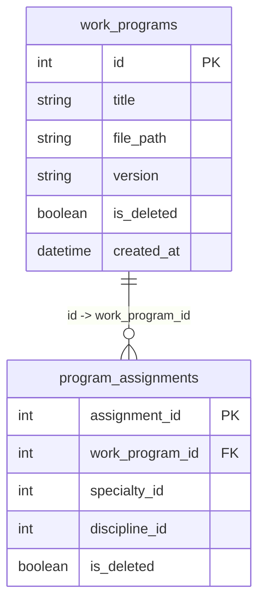

# Вариант №13 — Work Program Service (Сервис рабочих программ)

---

## ER-диаграмма в doc.md (Mermaid)

### Список реляционных связей в которых указано, какие поля из каких таблиц связываются:
* Поле `work_program_id` из транзитивной таблицы `program_assignments` связывается с первичным ключом `id` из главной таблицы `work_programs` (Явное указание связи: `work_programs.id -> program_assignments.work_program_id`).
* Поля `specialty_id` и `discipline_id` в таблице `program_assignments` не имеют связей на диаграмме и объявлены как обычные `int`, так как ссылаются на сущности из независимых внешних микросервисов.

### Комментарий по поводу соответствия таблиц 3НФ:
Все таблицы находятся в 3НФ. Поле `is_deleted` в таблицах `work_programs` и `program_assignments` является техническим атрибутом метаданных (логическим флагом состояния записи), который зависит исключительно от первичного ключа каждой из таблиц (`id` и `assignment_id` соответственно), не содержит транзитивных зависимостей и не нарушает правила третьей нормальной формы.

---

## Описание API для таблицы work_programs (Рабочая программа)

### 1. Добавить сущность

**Информация для создания (таблица):**

| Параметр (англ.) | Пояснение | Обязательность | Тип | Ограничение | Значение по умолчанию |
| :--- | :--- | :--- | :--- | :--- | :--- |
| title | Название программы | Да | string | — | — |
| file_path | Путь к файлу на сервере | Да | string | уникальный | — |
| version | Версия документа | Да | string | формат x.x | "1.0" |

**Уникальные комбинации параметров (если есть) — перечислить:**
* `(title, version)` — в системе не может быть двух программ с одинаковым названием и одинаковой версией.
* `file_path` — путь к файлу должен быть уникальным.

**Информация при успешном создании (таблица):**

| Параметр (англ.) | Тип |
| :--- | :--- |
| id | int |
| title | string |
| file_path | string |
| version | string |
| is_deleted | boolean |
| created_at | datetime |

### 2. Изменить сущность по ID

**Информация для изменения (таблица):**

| Параметр (англ.) | Пояснение | Обязательность | Тип | Ограничение |
| :--- | :--- | :--- | :--- | :--- |
| title | Название программы | Нет | string | — |
| file_path | Путь к файлу на сервере | Нет | string | уникальный |
| version | Версия документа | Нет | string | формат x.x |

**Информация при успешном изменении (таблица):**

| Параметр (англ.) | Тип |
| :--- | :--- |
| id | int |
| title | string |
| file_path | string |
| version | string |
| is_deleted | boolean |
| created_at | datetime |

### 3. Удалить сущность по ID
Реализовано мягкое удаление. При удалении поле `is_deleted` устанавливается в `True`.
* **Возвращаемое значение:** `true` (если запись найдена и помечена удалённой), иначе `false`.

### 4. Получить сущность по ID

**Возвращаемая информация (таблица):**

| Параметр (англ.) | Пояснение | Тип |
| :--- | :--- | :--- |
| id | Идентификатор программы | int |
| title | Название программы | string |
| file_path | Путь к файлу на сервере | string |
| version | Версия документа | string |
| is_deleted | Флаг мягкого удаления | boolean |
| created_at | Дата и время создания | datetime |

### 5. Получить список сущностей по заданным параметрам

**Параметры запроса (таблица):**

| Параметр (англ.) | Пояснение | Тип |
| :--- | :--- | :--- |
| version | Фильтр по точной строке версии программы (точное строковое совпадение) | string |

**Возвращаемый список (таблица с полями сущности):**

| Параметр (англ.) | Тип |
| :--- | :--- |
| id | int |
| title | string |
| file_path | string |
| version | string |

---

## Описание API для таблицы program_assignments (Назначение программы)

### 1. Добавить сущность

**Информация для создания (таблица):**

| Параметр (англ.) | Пояснение | Обязательность | Тип | Ограничение | Значение по умолчанию |
| :--- | :--- | :--- | :--- | :--- | :--- |
| work_program_id | ID связанной рабочей программы | Да | int | Foreign Key | — |
| specialty_id | ID внешней специальности | Да | int | — | — |
| discipline_id | ID внешней дисциплины | Да | int | — | — |

**Уникальные комбинации параметров (если есть) — перечислить:**
* `(work_program_id, specialty_id, discipline_id)` — исключает создание дублирующих связей.

**Информация при успешном создании (таблица):**

| Параметр (англ.) | Тип |
| :--- | :--- |
| assignment_id | int |
| work_program_id | int |
| specialty_id | int |
| discipline_id | int |
| is_deleted | boolean |

### 2. Изменить сущность по ID

**Информация для изменения (таблица):**

| Параметр (англ.) | Пояснение | Обязательность | Тип | Ограничение |
| :--- | :--- | :--- | :--- | :--- |
| work_program_id | ID связанной рабочей программы | Нет | int | Foreign Key |
| specialty_id | ID внешней специальности | Нет | int | — |
| discipline_id | ID внешней дисциплины | Нет | int | — |

**Информация при успешном изменении (таблица):**

| Параметр (англ.) | Тип |
| :--- | :--- |
| assignment_id | int |
| work_program_id | int |
| specialty_id | int |
| discipline_id | int |
| is_deleted | boolean |

### 3. Удалить сущность по ID
Реализовано мягкое удаление. При удалении `is_deleted` устанавливается в `True`.
* **Возвращаемое значение:** `true` (если запись найдена и помечена удалённой), иначе `false`.

### 4. Получить сущность по ID

**Возвращаемая информация (таблица):**

| Параметр (англ.) | Пояснение | Тип |
| :--- | :--- | :--- |
| assignment_id | Идентификатор назначения | int |
| work_program_id | ID связанной рабочей программы | int |
| specialty_id | ID внешней специальности | int |
| discipline_id | ID внешней дисциплины | int |
| is_deleted | Флаг мягкого удаления | boolean |

### 5. Получить список сущностей по заданным параметрам

**Параметры запроса (таблица):**

| Параметр (англ.) | Пояснение | Тип |
| :--- | :--- | :--- |
| specialty_id | Фильтр по числовому ID внешней специальности | int |
| discipline_id | Фильтр по числовому ID внешней дисциплины | int |

**Возвращаемый список (таблица с полями сущности):**

| Параметр (англ.) | Тип |
| :--- | :--- |
| assignment_id | int |
| work_program_id | int |
| specialty_id | int |
| discipline_id | int |
