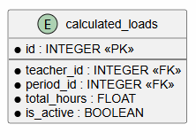

# Load Calculation Service (Сервис расчета нагрузки)

**Вариант 14**

Сервис автоматически рассчитывает, сколько часов должен отработать преподаватель в семестре, на основе данных из других сервисов (учебные планы, количество групп, закрепления).

## Сущность: CalculatedLoad (Результат расчёта нагрузки)

### Добавить CalculatedLoad

Информация требуемая для создания CalculatedLoad:

| Параметр | Пояснение | Обязательность | Тип | Ограничение | Значение по умолчанию |
|----------|-----------|----------------|-----|-------------|-----------------------|
| `teacher_id` | ID преподавателя | Да | int | >0 | — |
| `period_id` | ID учебного периода | Да | int | >0 | — |

**Уникальные комбинации параметров:**
- `teacher_id` + `period_id`

Информация возвращаемая в случае удачного создания CalculatedLoad:

| Параметр | Тип |
|----------|-----|
| `id` | int |
| `teacher_id` | int |
| `period_id` | int |
| `total_hours` | float |

**Примечание:** Поле `is_active` при создании всегда устанавливается в `true`, но не возвращается в ответе. Значение `total_hours` округляется до 2 знаков после запятой.

### Изменить CalculatedLoad по ID

Информация требуемая для изменения CalculatedLoad по ID:

| Параметр | Пояснение | Обязательность | Тип | Ограничение |
|----------|-----------|----------------|-----|-------------|
| `total_hours` | Новое значение нагрузки | Нет | float | ≥0 |

Информация возвращаемая в случае удачного изменения CalculatedLoad:

| Параметр | Тип |
|----------|-----|
| `id` | int |
| `teacher_id` | int |
| `period_id` | int |
| `total_hours` | float |

### Удалить CalculatedLoad по ID

Вернет `True`, если сущность была закрыта (удалена), иначе вернет `False`. Фактически запись из БД не удаляется, а реализуется через булевое поле `is_active`.

### Получить CalculatedLoad по ID

Информация возвращаемая в случае удачного поиска CalculatedLoad по ID:

| Параметр | Тип |
|----------|-----|
| `id` | int |
| `teacher_id` | int |
| `period_id` | int |
| `total_hours` | float |

### Получить список CalculatedLoad по заданным параметрам

Информация требуемая для получения списка CalculatedLoad:

| Параметр | Пояснение | Обязательность | Тип | Ограничение |
|----------|-----------|----------------|-----|-------------|
| `teacher_id` | Фильтр по ID преподавателя | Нет | int | >0 |
| `period_id` | Фильтр по ID учебного периода | Нет | int | >0 |
| `limit` | Максимальное количество записей в ответе | Нет | int | 1-1000 |
| `offset` | Количество пропущенных записей для пагинации | Нет | int | ≥0 |

Информация возвращаемая в виде списка CalculatedLoad:

| Параметр | Тип |
|----------|-----|
| `id` | int |
| `teacher_id` | int |
| `period_id` | int |
| `total_hours` | float |

### Получить список CalculatedLoad для преподавателя

**GET /teachers/{teacher_id}/loads**

Информация требуемая для получения списка нагрузок преподавателя:

| Параметр | Пояснение | Обязательность | Тип | Ограничение |
|----------|-----------|----------------|-----|-------------|
| `teacher_id` | ID преподавателя (в URL) | Да | int | >0 |
| `limit` | Максимальное количество записей в ответе | Нет | int | 1-1000 |
| `offset` | Количество пропущенных записей для пагинации | Нет | int | ≥0 |

Информация возвращаемая в виде списка CalculatedLoad для преподавателя:

| Параметр | Тип |
|----------|-----|
| `id` | int |
| `teacher_id` | int |
| `period_id` | int |
| `total_hours` | float |

## Доступные эндпоинты

| Метод | Эндпоинт | Описание |
|-------|----------|----------|
| POST | `/calculate` | Создание CalculatedLoad (автоматический расчёт) |
| GET | `/loads` | Получение списка CalculatedLoad с фильтрацией и пагинацией |
| GET | `/loads/{id}` | Получение CalculatedLoad по ID |
| PUT | `/loads/{id}` | Изменение CalculatedLoad по ID |
| DELETE | `/loads/{id}` | Удаление CalculatedLoad по ID (мягкое удаление) |
| GET | `/teachers/{teacher_id}/loads` | Получение списка CalculatedLoad для преподавателя (с пагинацией) |

## ER-диаграмма

