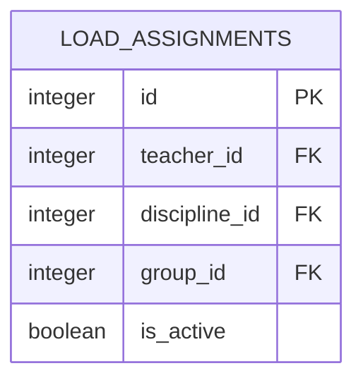

# Вариант №15. Load Assignment Service (Сервис распределения нагрузки)

## ER-Diagram

## API Description

### 1. Add LoadAssignment

**Request body:**

| Parameter | Description | Required | Type | Constraint | Default |
| :--- | :--- | :--- | :--- | :--- | :--- |
| **teacher_id** | Teacher ID | Yes | int | - | - |
| **discipline_id** | Discipline ID | Yes | int | - | - |
| **group_id** | Group ID | Yes | int | - | - |

*Unique combination: (teacher_id, discipline_id, group_id)*

**Response (201):**

| Parameter | Type |
| :--- | :--- |
| **id** | int |
| **teacher_id** | int |
| **discipline_id** | int |
| **group_id** | int |
| **is_active** | bool |

### 2. Update LoadAssignment by ID

**Request body:**

| Parameter | Description | Required | Type | Constraint |
| :--- | :--- | :--- | :--- | :--- |
| **teacher_id** | Teacher ID | No | int | - |
| **discipline_id** | Discipline ID | No | int | - |
| **group_id** | Group ID | No | int | - |
