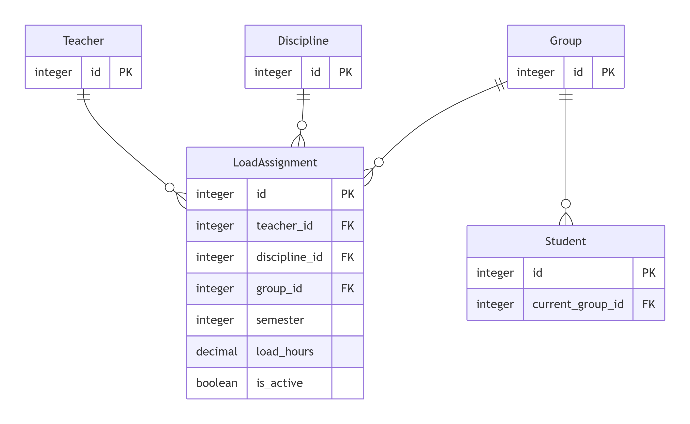

# 15. Load Assignment Service (Сервис распределения нагрузки)

## LoadAssignment
| Поле | Тип | Обязательность | Уникальность | Пояснение |
|------|-----|----------------|--------------|-----------|
| id | Integer | Да | Да | Идентификатор |
| teacher_id | Integer | Да | Нет | FK -> Teacher.id |
| discipline_id | Integer | Да | Нет | FK -> Discipline.id |
| group_id | Integer | Да | Нет | FK -> Group.id |
| semester | Integer | Да | Нет | 1-8 |
| load_hours | Decimal(5,2) | Да | Нет | >0 |

## Teacher
| Поле | Тип | Обязательность | Уникальность | Пояснение |
|------|-----|----------------|--------------|-----------|
| id | Integer | Да | Да | Идентификатор |
| full_name | Varchar(200) | Да | Да | ФИО |
| position | Varchar(100) | Да | Нет | Должность |

## Discipline
| Поле | Тип | Обязательность | Уникальность | Пояснение |
|------|-----|----------------|--------------|-----------|
| id | Integer | Да | Да | Идентификатор |
| name | Varchar(200) | Да | Да | Название |
| hours_total | Integer | Да | Нет | Часы |

## Group
| Поле | Тип | Обязательность | Уникальность | Пояснение |
|------|-----|----------------|--------------|-----------|
| id | Integer | Да | Да | Идентификатор |
| group_number | Varchar(20) | Да | Да | Номер |
| specialty_id | Integer | Да | Нет | Специальность |

## Student
| Поле | Тип | Обязательность | Уникальность | Пояснение |
|------|-----|----------------|--------------|-----------|
| id | Integer | Да | Да | Идентификатор |
| student_number | Varchar | Нет | Да | Номер студента |
| current_group_id | Integer | Нет | Нет | FK -> Group.id |
| status | Varchar | Да | Нет | Статус |

## Добавить LoadAssignment
| Параметр | Тип | Обязательность | Пояснение |
|----------|-----|----------------|-----------|
| teacher_id | int | Да | ID преподавателя |
| discipline_id | int | Да | ID дисциплины |
| group_id | int | Да | ID группы |
| semester | int | Да | Номер семестра (1-8) |
| load_hours | decimal | Да | Часы (>0) |

**Уникальная комбинация:** (teacher_id, discipline_id, group_id, semester)

**Возвращает:** id созданной записи

**При ошибке:** код ошибки и сообщение

## Изменить LoadAssignment по ID
| Параметр | Тип | Обязательность | Пояснение |
|----------|-----|----------------|-----------|
| id | int | Да | ID записи |
| teacher_id | int | Нет | ID преподавателя |
| discipline_id | int | Нет | ID дисциплины |
| group_id | int | Нет | ID группы |
| semester | int | Нет | Номер семестра (1-8) |
| load_hours | decimal | Нет | Часы (>0) |

**Возвращает:** обновлённую запись

**При ошибке:** код ошибки и сообщение

## Удалить LoadAssignment по ID
| Параметр | Тип | Обязательность | Пояснение |
|----------|-----|----------------|-----------|
| id | int | Да | ID записи |

**Возвращает:** success (bool)

**При ошибке:** код ошибки и сообщение

## Получить LoadAssignment по ID
| Параметр | Тип | Обязательность | Пояснение |
|----------|-----|----------------|-----------|
| id | int | Да | ID записи |

**Возвращает:** запись LoadAssignment

**При ошибке:** код ошибки и сообщение

## Получить список LoadAssignment
| Параметр | Тип | Обязательность | Пояснение |
|----------|-----|----------------|-----------|
| teacher_id | int | Нет | Фильтр по преподавателю |
| discipline_id | int | Нет | Фильтр по дисциплине |
| group_id | int | Нет | Фильтр по группе |
| semester | int | Нет | Фильтр по семестру |
| limit | int | Нет | Лимит записей |
| offset | int | Нет | Сдвиг |

**Возвращает:** массив LoadAssignment

### ER-диаграмма

