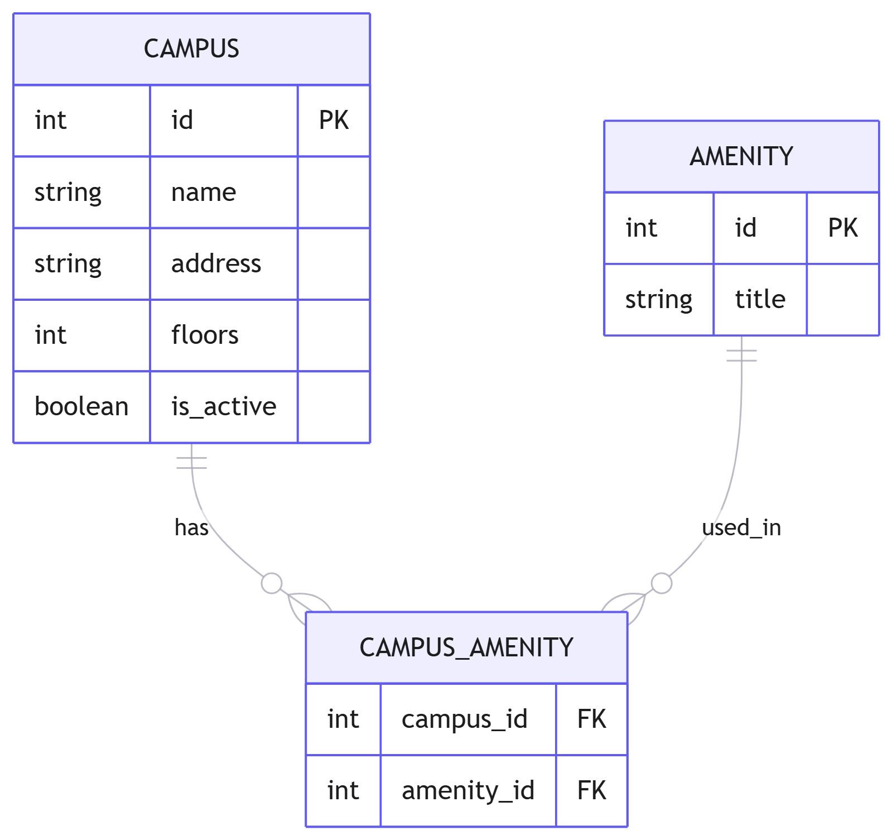

### Вариант №16. Сервис корпусов (Campus)

#### Добавление Campus

Информация требуемая для создания Campus

| Параметр | Обязательность | Тип | Ограничение | Значение по умолчанию |
|----------|----------------|-----|-------------|-----------------------|
| name | Обязательно | Строка | Уникальное, 3-50 символов | — |
| address | Обязательно | Строка | Не пустое | — |
| floors | Обязательно | Целое | Больше 0 | — |

Выходные данные

| Параметр | Тип |
|----------|-----|
| id | Целое |
| name | Строка |
| address | Строка |
| floors | Целое |
| is_active | Булево |

#### Изменение Campus по ID

Входные параметры

| Параметр | Обязательность | Тип | Ограничение | Значение по умолчанию |
|----------|----------------|-----|-------------|-----------------------|
| id | Обязательно | Целое | Существует в БД | — |
| name | Нет | Строка | Уникальное, 3-50 символов | — |
| address | Нет | Строка | Не пустое | — |
| floors | Нет | Целое | Больше 0 | — |

Выходные данные

| Параметр | Тип |
|----------|-----|
| id | Целое |
| name | Строка |
| address | Строка |
| floors | Целое |
| is_active | Булево |

#### Удаление Campus по ID

Входные параметры

| Параметр | Обязательность | Тип | Ограничение | Значение по умолчанию |
|----------|----------------|-----|-------------|-----------------------|
| id | Обязательно | Целое | Существует в БД | — |

Выходные данные

| Параметр | Тип | Описание |
|----------|-----|----------|
| result | Булево | Вернет True, если Campus был закрыт (удалён), иначе вернет False |

#### Получение Campus по ID

Входные параметры

| Параметр | Обязательность | Тип | Ограничение | Значение по умолчанию |
|----------|----------------|-----|-------------|-----------------------|
| id | Обязательно | Целое | Существует в БД | — |

Выходные данные

| Параметр | Тип |
|----------|-----|
| id | Целое |
| name | Строка |
| address | Строка |
| floors | Целое |
| is_active | Булево |

#### Получение списка Campus по параметрам

Входные параметры

| Параметр | Обязательность | Тип | Описание |
|----------|----------------|-----|----------|
| min_floors | Нет | Целое | Фильтр по минимальному количеству этажей |
| address_contains | Нет | Строка | Поиск по частичному совпадению адреса |

Выходные данные

| Параметр | Тип |
|----------|-----|
| id | Целое |
| name | Строка |
| address | Строка |
| floors | Целое |
| is_active | Булево |

### ER-диаграмма
