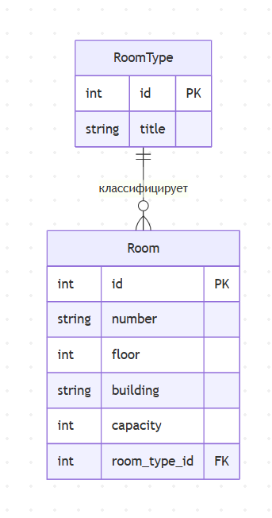

# Вариант №7. Сервис аудиторий (Room Service)
**Исполнитель:** Столяров Артем Сергеевич
**Группа:** 24-1П11

## Функционал сервиса
* Учет учебных помещений (кабинеты, лаборатории, мастерские).
* Хранение информации о расположении (корпус, этаж) и вместимости.
* Возможность изменения характеристик аудиторий.
* Фильтрация помещений по типу или корпусу.

---

## Добавить аудиторию
Информация требуемая для создания аудитории

| Параметр | Обязательность | Тип | Ограничение | Значение по умолчанию |
| :--- | :--- | :--- | :--- | :--- |
| number | Обязательно | Строка | Не пустое | — |
| floor | Обязательно | Целое | От 1 до 10 | — |
| building | Обязательно | Строка | Не пустое | — |
| capacity | Обязательно | Целое | Положительное | — |
| room_type_id | Обязательно | Целое | Существует в БД | 1 |

**Выходные данные**

| Параметр | Тип |
| :--- | :--- |
| message | Строка |

---

## Изменить аудиторию по ID
Информация требуемая для изменения

| Параметр | Обязательность | Тип | Ограничение | Значение по умолчанию |
| :--- | :--- | :--- | :--- | :--- |
| capacity | Не обязательно | Целое | > 0 | — |
| room_type_id | Не обязательно | Целое | FK | — |

**Выходные данные**

| Параметр | Тип |
| :--- | :--- |
| id | Целое |
| updated | Логический |

---

## Удаление аудитории по ID
Вернет **True**, если запись удалена успешно.

---

## Получить аудиторию по ID

| Параметр | Тип |
| :--- | :--- |
| id | Целое |
| number | Строка |
| building | Строка |
| room_type_title | Строка |
| capacity | Целое |

---

## ER-диаграмма

