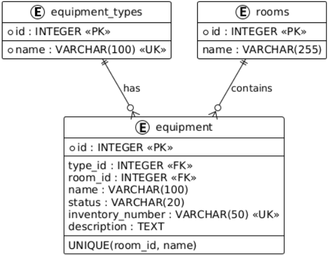

# Вариант №18. Сервис оборудования аудиторий (Room Equipment Service)

## Добавить оборудование

### Информация, требуемая для создания оборудования

| Параметр | Обязательность | Тип | Ограничение | Значение по умолчанию |
|----------|---------------|-----|-------------|----------------------|
| name | Обязательно | Строка | 1..100 символов | – |
| type_id | Обязательно | Целое | > 0, ссылка на id в таблице equipment_types | – |
| room_id | Обязательно | Целое | > 0 | – |
| status | Необязательно | Строка | active, broken, maintenance | active |
| inventory_number | Необязательно | Строка | Уникальный, до 50 символов | – |
| description | Необязательно | Строка | До 500 символов | "" |

**Уникальные комбинации параметров:** 
- `inventory_number` (уникальный)
- `room_id` + `name` (в одной аудитории не может быть двух одинаковых названий оборудования)

### Выходные данные

| Параметр | Тип |
|----------|-----|
| id | Целое |
| name | Строка |
| type_id | Целое |
| room_id | Целое |
| status | Строка |
| inventory_number | Строка |
| description | Строка |

---

## Изменить оборудование по ID

### Входные параметры

| Параметр | Обязательность | Тип | Ограничение | Значение по умолчанию |
|----------|---------------|-----|-------------|----------------------|
| name | Необязательно | Строка | 1..100 символов | – |
| type_id | Необязательно | Целое | > 0, ссылка на id в таблице equipment_types | – |
| room_id | Необязательно | Целое | > 0 | – |
| status | Необязательно | Строка | active, broken, maintenance | – |
| inventory_number | Необязательно | Строка | Уникальный, до 50 символов | – |
| description | Необязательно | Строка | До 500 символов | – |

### Выходные данные

| Параметр | Тип |
|----------|-----|
| id | Целое |
| name | Строка |
| type_id | Целое |
| room_id | Целое |
| status | Строка |
| inventory_number | Строка |
| description | Строка |

---

## Удалить оборудование по ID

### Выходные данные

| Параметр | Тип | Описание |
|----------|-----|----------|
| result | Логический | True – если запись удалена, False – если запись не найдена |

---

## Получить оборудование по ID

### Выходные данные

| Параметр | Тип |
|----------|-----|
| id | Целое |
| name | Строка |
| type_id | Целое |
| room_id | Целое |
| status | Строка |
| inventory_number | Строка |
| description | Строка |

---

## Получить список оборудования по заданным параметрам

### Входные параметры

| Параметр | Тип | Описание |
|----------|-----|----------|
| room_id | Целое | Фильтр по ID аудитории |
| type_id | Целое | Фильтр по ID типа оборудования |
| status | Строка | Фильтр по статусу (active, broken, maintenance) |
| search | Строка | Поиск по названию или инвентарному номеру |

### Выходные данные (список)

| Параметр | Тип |
|----------|-----|
| id | Целое |
| name | Строка |
| type_id | Целое |
| room_id | Целое |
| status | Строка |
| inventory_number | Строка |
| description | Строка |

---

## ER-диаграмма
