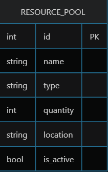

# Вариант 19 — Resource Pool Service (Сервис пула ресурсов)

## Функции сервиса (оценка 3)

1. **Создание ресурса** — добавление нового ресурса в систему
2. **Изменение ресурса по ID** — обновление данных существующего ресурса
3. **Удаление ресурса по ID** — мягкое удаление (деактивация) ресурса
4. **Получение ресурса по ID** — просмотр деталей одного ресурса
5. **Получение списка ресурсов** — фильтрация и пагинация ресурсов

---

## 1. Создание ресурса

**Параметры запроса**

| Параметр | Пояснение | Обязательность | Тип | Ограничение | Значение по умолчанию |
|----------|-----------|----------------|-----|-------------|-----------------------|
| name | Название ресурса | Да | string | 1–100 символов | - |
| description | Описание ресурса | Нет | string | до 500 символов | null |
| category_id | ID категории ресурса | Да | integer | существующий id из ResourceCategory | - |
| total_quantity | Общее количество единиц | Да | integer | ≥ 1 | 1 |
| unit | Единица измерения | Да | string | 'шт', 'компл', 'экз' | 'шт' |
| status | Статус ресурса | Нет | string | 'available', 'maintenance', 'retired' | 'available' |

**Уникальные комбинации параметров**
- `(name, category_id)` – в пределах одной категории не может быть двух ресурсов с одинаковым названием.

**Возвращаемые данные (при успешном создании)**

| Параметр | Тип |
|----------|-----|
| id | integer |
| name | string |
| description | string или null |
| category_id | integer |
| total_quantity | integer |
| available_quantity | integer |
| unit | string |
| status | string |
| created_at | string (ISO 8601) |
| updated_at | string (ISO 8601) |

---

## 2. Изменение ресурса по ID

**Параметры запроса** (все поля, кроме id, необязательны)

| Параметр | Пояснение | Обязательность | Тип | Ограничение | Значение по умолчанию |
|----------|-----------|----------------|-----|-------------|-----------------------|
| name | Новое название | Нет | string | 1–100 символов | - |
| description | Новое описание | Нет | string | до 500 символов | - |
| category_id | Новая категория | Нет | integer | существующий id из ResourceCategory | - |
| total_quantity | Новое общее количество | Нет | integer | ≥ 1 | - |
| unit | Новая единица измерения | Нет | string | 'шт', 'компл', 'экз' | - |
| status | Новый статус | Нет | string | 'available', 'maintenance', 'retired' | - |

**Возвращаемые данные (при успешном изменении)**

| Параметр | Тип |
|----------|-----|
| id | integer |
| name | string |
| description | string или null |
| category_id | integer |
| total_quantity | integer |
| available_quantity | integer |
| unit | string |
| status | string |
| created_at | string (ISO 8601) |
| updated_at | string (ISO 8601) |

---

## 3. Удаление ресурса по ID

**Возвращаемые данные**

| Параметр | Тип |
|----------|-----|
| success | boolean |

> Вернёт `true`, если ресурс был деактивирован (`is_active = false`), иначе `false`. Физически запись из БД не удаляется.

---

## 4. Получение ресурса по ID

| Параметр | Тип |
|----------|-----|
| id | integer |

**Возвращаемые данные (при успешном поиске)**

| Параметр | Тип |
|----------|-----|
| id | integer |
| name | string |
| description | string или null |
| category_id | integer |
| total_quantity | integer |
| available_quantity | integer |
| unit | string |
| status | string |
| created_at | string (ISO 8601) |
| updated_at | string (ISO 8601) |

---

## 5. Получение списка ресурсов по параметрам

**Параметры запроса**

| Параметр | Пояснение | Тип | Описание |
|----------|-----------|-----|----------|
| category_id | Фильтр по категории | integer | опционально |
| status | Фильтр по статусу | string | 'available', 'maintenance', 'retired' |
| search | Поиск по имени | string | частичное совпадение |
| limit | Количество записей | integer | от 1 до 100, по умолчанию 20 |
| offset | Смещение | integer | ≥ 0, по умолчанию 0 |

**Возвращаемые данные** – массив объектов ресурсов, каждый из которых содержит следующие поля:

| Параметр | Тип |
|----------|-----|
| id | integer |
| name | string |
| description | string или null |
| category_id | integer |
| total_quantity | integer |
| available_quantity | integer |
| unit | string |
| status | string |
| created_at | string (ISO 8601) |
| updated_at | string (ISO 8601) |

---

## ER-диаграмма

