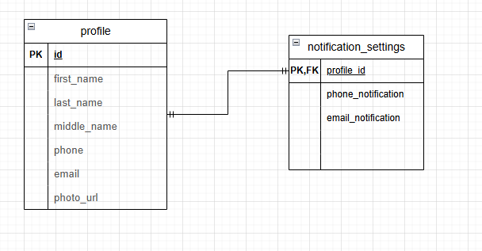

# Вариант №2. Сервис профилей (Profile Service)

## Создание профиля

Информация требуемая для создания профиля пользователя

| Параметр | Обязательность | Тип | Ограничение | Значение по умолчанию |
|----------|----------------|-----|-------------|----------------------|
| first_name | Обязательно | Строка | Не пустое | — |
| last_name | Обязательно | Строка | Не пустое | — |
| middle_name | Не обязательно | Строка | — | — |
| photo_url | Не обязательно | Строка | URL | — |

Выходные данные

| Параметр | Тип |
|----------|-----|
| id | Целое |
| first_name | Строка |
| last_name | Строка |
| middle_name | Строка |
| photo_url | Строка |

## Изменить профиль по ID

Информация требуемая для изменения профиля по ID

| Параметр | Обязательность | Тип | Ограничение | Значение по умолчанию |
|----------|----------------|-----|-------------|----------------------|
| first_name | Не обязательно | Строка | Не пустое | — |
| last_name | Не обязательно | Строка | Не пустое | — |
| middle_name | Не обязательно | Строка | — | — |
| photo_url | Не обязательно | Строка | URL | — |

Выходные данные

| Параметр | Тип |
|----------|-----|
| id | Целое |
| first_name | Строка |
| last_name | Строка |
| middle_name | Строка |
| photo_url | Строка |

## Удаление профиля по ID

Вернет True, если профиль был удален, иначе вернет False

## Получить профиль по ID

Выходные данные

| Параметр | Тип |
|----------|-----|
| id | Целое |
| first_name | Строка |
| last_name | Строка |
| middle_name | Строка |
| photo_url | Строка |

## Получить список профилей по заданным параметрам

Информация требуемая для получения списка профилей

| Параметр | Тип | Описание |
|----------|-----|----------|
| first_name | Строка | Фильтр по имени |
| last_name | Строка | Фильтр по фамилии |

Информация возвращается в виде списка профилей

| Параметр | Тип |
|----------|-----|
| id | Целое |
| first_name | Строка |
| last_name | Строка |
| middle_name | Строка |
| photo_url | Строка |

## Добавить контакт

Информация требуемая для добавления контакта

| Параметр | Обязательность | Тип | Ограничение | Значение по умолчанию |
|----------|----------------|-----|-------------|----------------------|
| profile_id | Обязательно | Целое | Существующий профиль | — |
| contact_type | Обязательно | Строка | Допустимые значения: 'phone', 'email' | — |
| contact_value | Обязательно | Строка | Уникальный в рамках типа для профиля | — |

Выходные данные

| Параметр | Тип |
|----------|-----|
| id | Целое |
| profile_id | Целое |
| contact_type | Строка |
| contact_value | Строка |

## Получить контакты профиля

Входные параметры

| Параметр | Обязательность | Тип |
|----------|----------------|-----|
| profile_id | Обязательно | Целое |

Выходные данные (список)

| Параметр | Тип |
|----------|-----|
| id | Целое |
| contact_type | Строка |
| contact_value | Строка |

## Удалить контакт по ID

Вернет True, если контакт был удален, иначе вернет False

## Изменить контакт по ID

| Параметр | Обязательность | Тип | Ограничение | Значение по умолчанию |
|----------|----------------|-----|-------------|----------------------|
| contact_value | Не обязательно | Строка | Уникальный в рамках типа для профиля | — |

Выходные данные

| Параметр | Тип |
|----------|-----|
| id | Целое |
| contact_type | Строка |
| contact_value | Строка |

## Изменить настройки уведомлений

| Параметр | Обязательность | Тип | Значение по умолчанию |
|----------|----------------|-----|----------------------|
| profile_id | Обязательно | Целое | — |
| phone_notification | Не обязательно | Логика | True |
| email_notification | Не обязательно | Логика | True |

Выходные данные

| Параметр | Тип |
|----------|-----|
| profile_id | Целое |
| phone_notification | Логика |
| email_notification | Логика |

## Получить настройки уведомлений по profile_id

Входные параметры

| Параметр | Обязательность | Тип |
|----------|----------------|-----|
| profile_id | Обязательно | Целое |

Выходные данные

| Параметр | Тип |
|----------|-----|
| profile_id | Целое |
| phone_notification | Логика |
| email_notification | Логика |

## ER-диаграмма

              
