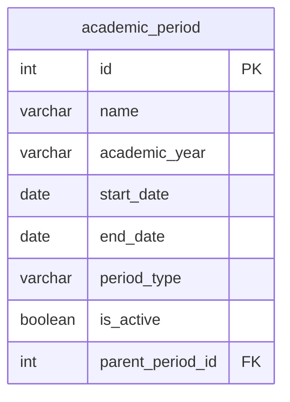

# Вариант №20. Сервис учебных периодов (Academic Period)

## Добавить учебный период

### Информация, требуемая для создания учебного периода

| Параметр | Пояснение | Обязательность | Тип | Ограничение |
|----------|-----------|----------------|-----|-------------|
| name | Название учебного периода | Обязательно | Строка | 1-100 символов |
| academic_year | Учебный год в формате ГГГГ-ГГГГ | Обязательно | Строка | Формат 2025-2026 | 
| start_date | Дата начала учебного периода | Обязательно | Дата | Не ранее 2000-01-01 | 
| end_date | Дата окончания учебного периода | Обязательно | Дата | Больше start_date | 
| period_type | Тип периода (семестр или модуль) | Обязательно | Строка | semester, module |
| parent_period_id | ID родительского периода (0 для семестра, ID семестра для модуля) | Необязательно | Целое | 0 - для семестра, ID семестра - для модуля | 

**Уникальная комбинация параметров:** `name` и `academic_year`

### Выходные данные

| Параметр | Тип |
|----------|-----|
| id | Целое |
| name | Строка | 
| academic_year | Строка |
| start_date | Дата | 
| end_date | Дата | 
| period_type | Строка | 
| parent_period_id | Целое | 
| is_active | Логический | 

---

## Изменить учебный период по ID

| Параметр | Пояснение | Обязательность | Тип | Ограничение |
|----------|-----------|----------------|-----|-------------|
| name | Название учебного периода | Необязательно | Строка | 1-100 символов |
| academic_year | Учебный год в формате ГГГГ-ГГГГ | Необязательно | Строка | Формат 2025-2026 |
| start_date | Дата начала учебного периода | Необязательно | Дата | Не ранее 2000-01-01 |
| end_date | Дата окончания учебного периода | Необязательно | Дата | Больше start_date |
| period_type | Тип периода | Необязательно | Строка | semester, module |
| parent_period_id | ID родительского периода | Необязательно | Целое | 0 – для семестра, ID семестра – для модуля |

**Уникальная комбинация параметров:** `name` и `academic_year` (при изменении нельзя создать дубликат с существующим периодом)

### Выходные данные

| Параметр | Тип | 
|----------|-----|
| id | Целое |
| name | Строка |
| academic_year | Строка |
| start_date | Дата | 
| end_date | Дата |
| period_type | Строка | 
| parent_period_id | Целое |
| is_active | Логический |

---

## Удалить учебный период по ID

### Выходные данные

| Параметр | Тип | Пояснение |
|----------|-----|-----------|
| result | Логический | True, если учебный период был удален, иначе False |

---

## Получить учебный период по ID

### Выходные данные

| Параметр | Тип | 
|----------|-----|
| id | Целое | 
| name | Строка | 
| academic_year | Строка | 
| start_date | Дата | 
| end_date | Дата | 
| period_type | Строка |
| parent_period_id | Целое | 
| is_active | Логический | 

---

## Получить список учебных периодов по заданным параметрам

### Параметры запроса

| Параметр | Пояснение | Тип | Обязательность |
|----------|-----------|-----|----------------|
| academic_year | Фильтр по учебному году | Строка | Необязательно |
| period_type | semester, module | Строка | Необязательно | 
| name_contains | Поиск по части имени | Строка | Необязательно |
| parent_period_id | Фильтр по родительскому периоду (0 – корневые) | Целое | Необязательно |

Если параметр не указан — фильтр по этому полю не применяется.

### Выходные данные (список)

| Параметр | Тип |
|----------|-----|
| id | Целое |
| name | Строка |
| academic_year |
| start_date | Дата |
| end_date | Дата |
| period_type | Строка | 
| parent_period_id | Целое |
| is_active | Логический | 

---

## ER-диаграмма

