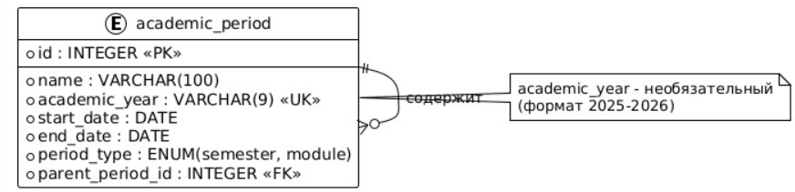

# Вариант №20. Сервис учебных периодов (Academic Period)

## Добавить учебный период

### Информация, требуемая для создания учебного периода

| Параметр | Пояснение | Обязательность | Тип | Ограничение | Значение по умолчанию |
|----------|-----------|----------------|-----|-------------|----------------------|
| name | - | Обязательно | Строка | 1-100 символов | - |
| academic_year | - | Обязательно | Строка | Формат 2025-2026 | - |
| start_date | - | Обязательно | Дата | Не ранее 2000-01-01 | - |
| end_date | - | Обязательно | Дата | Больше start_date | - |
| period_type | - | Обязательно | Строка | semester, module | semester |
| parent_period_id | - | Необязательно | Целое | 0 - для семестра, ID семестра - для модуля | 0 |

**Уникальная комбинация параметров:** `name` и `academic_year`

### Выходные данные

| Параметр | Тип | Пояснение |
|----------|-----|-----------|
| id | Целое | Уникальный идентификатор созданного учебного периода |
| name | Строка | Название учебного периода |
| academic_year | Строка | Учебный год в формате ГГГГ-ГГГГ |
| start_date | Дата | Дата начала учебного периода |
| end_date | Дата | Дата окончания учебного периода |
| period_type | Строка | Тип периода: semester или module |
| parent_period_id | Целое | ID родительского периода (0 для семестра, ID семестра для модуля) |
| is_active | Логический | Активен ли период (true/false) |

---

## Изменить учебный период по ID

| Параметр | Пояснение | Обязательность | Тип | Ограничение | Значение по умолчанию |
|----------|-----------|----------------|-----|-------------|----------------------|
| name | | Необязательно | Строка | 1-100 символов | – |
| academic_year | | Необязательно | Строка | Формат 2025-2026 | – |
| start_date | | Необязательно | Дата | Не ранее 2000-01-01 | – |
| end_date | | Необязательно | Дата | Больше start_date | – |
| period_type | | Необязательно | Строка | semester, module | – |
| parent_period_id | | Необязательно | Целое | 0 – для семестра, ID семестра – для модуля | – |

**Уникальная комбинация параметров:** `name` и `academic_year` (при изменении нельзя создать дубликат с существующим периодом)

### Выходные данные

| Параметр | Тип | Пояснение |
|----------|-----|-----------|
| id | Целое | Уникальный идентификатор учебного периода |
| name | Строка | Название учебного периода |
| academic_year | Строка | Учебный год в формате ГГГГ-ГГГГ |
| start_date | Дата | Дата начала учебного периода |
| end_date | Дата | Дата окончания учебного периода |
| period_type | Строка | Тип периода: semester или module |
| parent_period_id | Целое | ID родительского периода (0 для семестра, ID семестра для модуля) |
| is_active | Логический | Активен ли период (true/false) |

---

## Удалить учебный период по ID

### Выходные данные

| Параметр | Тип | Пояснение |
|----------|-----|-----------|
| result | Логический | True, если учебный период был удален, иначе False |

---

## Получить учебный период по ID

### Выходные данные

| Параметр | Тип | Пояснение |
|----------|-----|-----------|
| id | Целое | Уникальный идентификатор учебного периода |
| name | Строка | Название учебного периода |
| academic_year | Строка | Учебный год в формате ГГГГ-ГГГГ |
| start_date | Дата | Дата начала учебного периода |
| end_date | Дата | Дата окончания учебного периода |
| period_type | Строка | Тип периода: semester или module |
| parent_period_id | Целое | ID родительского периода (0 для семестра, ID семестра для модуля) |
| is_active | Логический | Активен ли период (true/false) |

---

## Получить список учебных периодов по заданным параметрам

### Информация, требуемая для получения списка учебных периодов

| Параметр | Тип | Пояснение |
|----------|-----|-----------|
| academic_year | Строка | Фильтр по учебному году |
| period_type | Строка | semester, module |
| name_contains | Строка | Поиск по части имени |
| parent_period_id | Целое | Фильтр по родительскому периоду (0 – корневые) |

### Выходные данные (список)

| Параметр | Тип | Пояснение |
|----------|-----|-----------|
| id | Целое | Уникальный идентификатор учебного периода |
| name | Строка | Название учебного периода |
| academic_year | Строка | Учебный год в формате ГГГГ-ГГГГ |
| start_date | Дата | Дата начала учебного периода |
| end_date | Дата | Дата окончания учебного периода |
| period_type | Строка | Тип периода: semester или module |
| parent_period_id | Целое | ID родительского периода (0 для семестра, ID семестра для модуля) |
| is_active | Логический | Активен ли период (true/false) |

---

## ER-диаграмма

 
