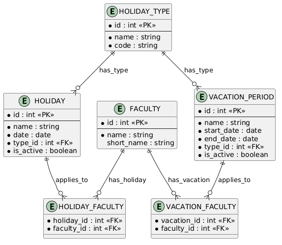

### Вариант №21. Сервис каникул и праздников (Holiday)

#### Добавление Holiday

Информация требуемая для создания Holiday

| Параметр | Обязательность | Тип | Ограничение | Значение по умолчанию |
|----------|----------------|-----|-------------|-----------------------|
| name | Обязательно | Строка | Уникальное, не пустое, до 100 символов | — |
| start_date | Обязательно | Дата | Не пустое, дата начала | — |
| end_date | Обязательно | Дата | Не пустое, дата окончания >= start_date | — |
| type | Обязательно | Строка | "holiday" или "vacation" | "holiday" |

Уникальные комбинации параметров: Отсутствуют. Идентификатор id генерируется автоматически.

Информация возвращаемая в случае удачного создания Holiday

| Параметр | Тип |
|----------|-----|
| id | Целое |
| name | Строка |
| start_date | Дата |
| end_date | Дата |
| type | Строка |
| is_active | Булево |

#### Изменение Holiday по ID

Информация требуемая для изменения Holiday по ID

| Параметр | Обязательность | Тип | Ограничение | Значение по умолчанию |
|----------|----------------|-----|-------------|-----------------------|
| id | Обязательно | Целое | Существует в БД | — |
| name | Нет | Строка | Уникальное, не пустое, до 100 символов | — |
| start_date | Нет | Дата | Не пустое | — |
| end_date | Нет | Дата | Не пустое, >= start_date | — |
| type | Нет | Строка | "holiday" или "vacation" | — |
| is_active | Нет | Булево | — | — |

Информация возвращаемая в случае удачного изменения Holiday

| Параметр | Тип |
|----------|-----|
| id | Целое |
| name | Строка |
| start_date | Дата |
| end_date | Дата |
| type | Строка |
| is_active | Булево |

#### Удаление Holiday по ID

Вернет True, если Holiday была закрыта (удалена), иначе вернет False

#### Получить Holiday по ID

Информация возвращаемая в случае удачного поиска Holiday по ID

| Параметр | Тип |
|----------|-----|
| id | Целое |
| name | Строка |
| start_date | Дата |
| end_date | Дата |
| type | Строка |
| is_active | Булево |

#### Получить список Holiday по заданным параметрам

Информация требуемая для получения списка Holiday

| Параметр | Тип | Описание |
|----------|-----|----------|
| date_from | Дата | Фильтр по дате начала периода |
| date_to | Дата | Фильтр по дате окончания периода |
| type | Строка | Фильтр по типу ("holiday" или "vacation") |

Информация возвращается в виде списка Holiday

| Параметр | Тип |
|----------|-----|
| id | Целое |
| name | Строка |
| start_date | Дата |
| end_date | Дата |
| type | Строка |
| is_active | Булево |

### ER-диаграмма
