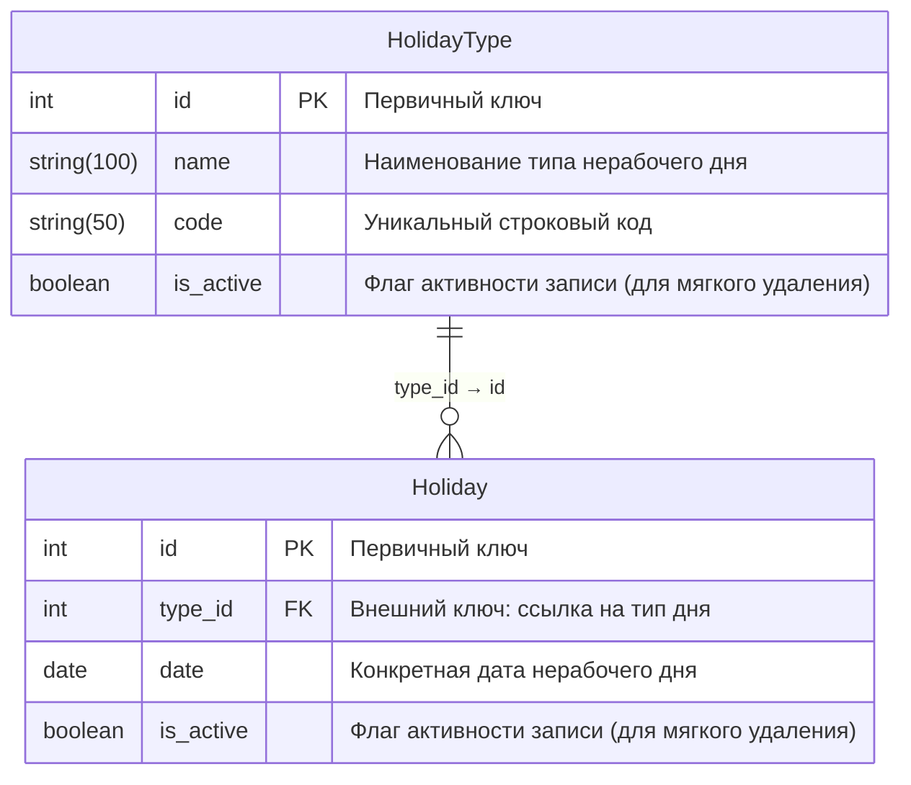

# Отчет по лабораторной работе (Оценка 3)

**Номер варианта:** 21  
**Название сервиса:** Holiday Service (Сервис каникул и праздников)  

---

## 1. Описание API

> **Важно:** Данный сервис реализует **мягкое удаление** записей для всех сущностей. При удалении записи поле `is_active` переводится в значение `false`. Запись физически остается в БД. Метод удаления возвращает `true` (если запись найдена и успешно помечена удаленной), иначе `false`.

### 1.1. Сущность: HolidayType (Справочник типов нерабочих дней)

#### 1. Добавить сущность
**Информация для создания:**

| Параметр (англ.) | Пояснение | Обязательность | Тип | Ограничение | Значение по умолчанию |
| :--- | :--- | :--- | :--- | :--- | :--- |
| `name` | Полное наименование типа (например, «Государственный праздник», «Каникулы») | Да | string | max length: 100 | — |
| `code` | Строковый уникальный идентификатор типа (например, «holiday», «vacation») | Да | string | max length: 50, unique | — |

**Уникальные комбинации параметров:**
* `code` — является уникальным ключом (запрещено дублирование строкового кода для разных типов дней).

**Информация при успешном создании:**

| Параметр (англ.) | Тип |
| :--- | :--- |
| `id` | int |

#### 2. Изменить сущность по ID
**Информация для изменения:**

| Параметр (англ.) | Пояснение | Обязательность | Тип | Ограничение |
| :--- | :--- | :--- | :--- | :--- |
| `name` | Обновленное наименование типа | Нет | string | max length: 100 |
| `code` | Обновленный строковый уникальный идентификатор | Нет | string | max length: 50, unique |

**Информация при успешном изменении:**

| Параметр (англ.) | Тип |
| :--- | :--- |
| `id` | int |
| `name` | string |
| `code` | string |

#### 3. Удалить сущность по ID
* **Тип удаления:** Мягкое удаление (`is_active` устанавливается в `false`).
* **Возвращаемое значение:** `true` (если запись найдена и помечена удалённой), иначе `false` (boolean).

#### 4. Получить сущность по ID
**Возвращаемая информация:**

| Параметр (англ.) | Пояснение | Тип |
| :--- | :--- | :--- |
| `id` | Уникальный идентификатор записи | int |
| `name` | Наименование типа нерабочего дня | string |
| `code` | Строковый код типа | string |
| `is_active` | Статус активности записи в системе | boolean |

#### 5. Получить список сущностей по заданным параметрам
**Параметры запроса:**

| Параметр (англ.) | Пояснение | Тип |
| :--- | :--- | :--- |
| `is_active` | Фильтр по статусу активности записи (по умолчанию возвращаются только `true`) | boolean |

**Возвращаемый список:**

| Параметр (англ.) | Тип |
| :--- | :--- |
| `id` | int |
| `name` | string |
| `code` | string |
| `is_active` | boolean |

---

### 1.2. Сущность: Holiday (Календарь нерабочих дней)

#### 1. Добавить сущность
**Информация для создания:**

| Параметр (англ.) | Пояснение | Обязательность | Тип | Ограничение | Значение по умолчанию |
| :--- | :--- | :--- | :--- | :--- | :--- |
| `type_id` | Идентификатор типа дня (внешний ключ) | Да | int | Должен существовать в HolidayType.id | — |
| `date` | Конкретная календарная дата | Да | date | Формат YYYY-MM-DD | — |

**Уникальные комбинации параметров:**
* Уникальные комбинации отсутствуют.

**Информация при успешном создании:**

| Параметр (англ.) | Тип |
| :--- | :--- |
| `id` | int |

#### 2. Изменить сущность по ID
**Информация для изменения:**

| Параметр (англ.) | Пояснение | Обязательность | Тип | Ограничение |
| :--- | :--- | :--- | :--- | :--- |
| `type_id` | Новый идентификатор типа дня | Нет | int | Должен существовать в HolidayType.id |
| `date` | Новая календарная дата | Нет | date | Формат YYYY-MM-DD |

**Информация при успешном изменении:**

| Параметр (англ.) | Тип |
| :--- | :--- |
| `id` | int |
| `type_id` | int |
| `date` | date |

#### 3. Удалить сущность по ID
* **Тип удаления:** Мягкое удаление (`is_active` устанавливается в `false`).
* **Возвращаемое значение:** `true` (если запись найдена и помечена удалённой), иначе `false` (boolean).

#### 4. Получить сущность по ID
**Возвращаемая информация:**

| Параметр (англ.) | Пояснение | Тип |
| :--- | :--- | :--- |
| `id` | Уникальный идентификатор записи | int |
| `type_id` | Идентификатор связанного типа дня | int |
| `date` | Календарная дата | date |
| `is_active` | Статус активности записи в системе | boolean |

#### 5. Получить список сущностей по заданным параметрам
**Параметры запроса:**

| Параметр (англ.) | Пояснение | Тип |
| :--- | :--- | :--- |
| `type_id` | Фильтр по идентификатору типа дня для получения праздников конкретной категории | int |
| `date_from` | Фильтр «Дата от». Используется для фильтрации праздников по диапазону дат. Проверяет строгое вхождение даты праздника в интервал, где `date` должна быть больше или равна `date_from`. | date |
| `date_to` | Фильтр «Дата до». Используется для фильтрации праздников по диапазону дат. Проверяет строгое вхождение даты праздника в интервал, где `date` должна быть меньше или равна `date_to`. Совместно параметры формируют закрытый диапазон `[date_from, date_to]`. | date |
| `is_active` | Фильтр по статусу активности записи | boolean |

**Возвращаемый список:**

| Параметр (англ.) | Тип |
| :--- | :--- |
| `id` | int |
| `type_id` | int |
| `date` | date |
| `is_active` | boolean |

---

## 2. Модели базы данных (ER-диаграмма)

ER-диаграмма описывает структуру таблиц в третьей нормальной форме (3НФ) с явным указанием типов и ограничений по длине полей на латинице.

