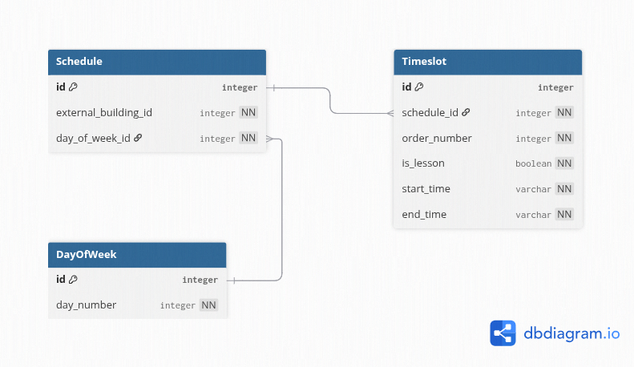

### Вариант №22. Сервис временных слотов (Timeslot)

#### Функционал сервиса

Сервис хранит расписание пар и перемен (начало/конец) для разных корпусов и дней недели. Перемены могут быть любой длительности – задаётся временем начала и окончания.

**Зависимости от других сервисов:**
- `Campus Service` (уровень 4) – предоставляет идентификаторы корпусов. Реализована заглушка.

**Внутренние сущности:**
- `DayOfWeek` – справочник дней недели (1..7).

#### Правила валидации данных

- Для временного слота: `start_time` < `end_time`; `order_number` > 0; комбинация (`schedule_id`, `order_number`) уникальна.
- Для расписания: комбинация (`external_building_id`, `day_of_week_id`) уникальна.
- `external_building_id` проверяется заглушкой (допустимые значения 1–10).
- `day_of_week_id` должен существовать в таблице `DayOfWeek`.

#### Создание временного слота

Информация требуемая для создания временного слота

| Параметр      | Обязательность | Тип         | Ограничение                                    | Значение по умолчанию |
|---------------|----------------|-------------|------------------------------------------------|-----------------------|
| schedule_id   | Обязательно    | Целое       | Существующий id расписания                     | —                     |
| order_number  | Обязательно    | Целое       | Положительное, уникально для данного schedule  | —                     |
| is_lesson     | Обязательно    | Логический  | True – пара, False – перемена                  | —                     |
| start_time    | Обязательно    | Время       | Формат HH:MM:SS, меньше end_time               | —                     |
| end_time      | Обязательно    | Время       | Формат HH:MM:SS, больше start_time             | —                     |

Уникальные комбинации параметров: (schedule_id, order_number)

Выходные данные

| Параметр      | Тип         |
|---------------|-------------|
| id            | Целое       |
| schedule_id   | Целое       |
| order_number  | Целое       |
| is_lesson     | Логический  |
| start_time    | Время       |
| end_time      | Время       |

#### Изменение временного слота по ID

Информация требуемая для изменения временного слота по ID

| Параметр      | Обязательность | Тип         | Ограничение                                    | Значение по умолчанию |
|---------------|----------------|-------------|------------------------------------------------|-----------------------|
| schedule_id   | Опционально    | Целое       | Существующий id расписания                     | —                     |
| order_number  | Опционально    | Целое       | Положительное, уникальность в рамках расписания| —                     |
| is_lesson     | Опционально    | Логический  | True – пара, False – перемена                  | —                     |
| start_time    | Опционально    | Время       | Меньше end_time                                | —                     |
| end_time      | Опционально    | Время       | Больше start_time                              | —                     |

Выходные данные

| Параметр      | Тип         |
|---------------|-------------|
| id            | Целое       |
| schedule_id   | Целое       |
| order_number  | Целое       |
| is_lesson     | Логический  |
| start_time    | Время       |
| end_time      | Время       |

#### Удаление временного слота по ID

Вернет `True`, если слот был удалён, иначе `False`

#### Получение временного слота по ID

Выходные данные

| Параметр      | Тип         |
|---------------|-------------|
| id            | Целое       |
| schedule_id   | Целое       |
| order_number  | Целое       |
| is_lesson     | Логический  |
| start_time    | Время       |
| end_time      | Время       |

#### Получение списка временных слотов по заданным параметрам

Информация требуемая для получения списка

| Параметр                | Тип         | Описание                                            |
|-------------------------|-------------|-----------------------------------------------------|
| schedule_id             | Целое       | Фильтр по id расписания (опционально)               |
| external_building_id    | Целое       | Фильтр по корпусу (опционально)                     |
| day_of_week_id          | Целое       | Фильтр по дню недели (опционально)                  |
| order_number            | Целое       | Фильтр по порядковому номеру (опционально)          |
| is_lesson               | Логический  | Фильтр по типу: пара или перемена (опционально)     |

Выходные данные – список временных слотов

Каждый элемент списка:

| Параметр      | Тип         |
|---------------|-------------|
| id            | Целое       |
| schedule_id   | Целое       |
| order_number  | Целое       |
| is_lesson     | Логический  |
| start_time    | Время       |
| end_time      | Время       |

### ER-диаграмма

