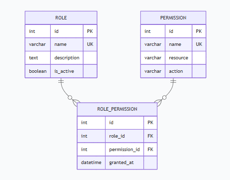

# Role Service (Сервис ролей) - Вариант 3

## Описание сервиса
Сервис управляет ролями (Админ, Директор, Завуч, Преподаватель, Студент, Родитель) и правами доступа (RBAC).  
Сервис **не хранит** пользователей, их профили, аутентификацию, логи, сессии — это зона ответственности других сервисов.

## Сущность: Role (Роль)

### Информация, требуемая для создания роли
| Параметр | Пояснение | Обязательность | Тип | Ограничение | Значение по умолчанию |
|----------|-----------|----------------|-----|-------------|----------------------|
| name | Название роли (например, преподаватель) | Да | string | уникально, 3-50 символов | - |
| description | Описание роли | Нет | string | до 200 символов | NULL |
| is_active | Активна ли роль | Нет | boolean | True/False | True |

**Уникальные комбинации параметров:** `name` – уникальное поле.

### Информация, возвращаемая при успешном создании роли
| Параметр | Тип |
|----------|-----|
| id | integer |
| name | string |
| description | string |
| is_active | boolean |

## Изменение роли по ID

### Информация, требуемая для изменения роли
| Параметр | Пояснение | Обязательность | Тип | Ограничение |
|----------|-----------|----------------|-----|-------------|
| name | Новое название роли | Нет | string | уникально, 3-50 символов |
| description | Новое описание | Нет | string | до 200 символов |
| is_active | Флаг активности | Нет | boolean | True/False |

### Информация, возвращаемая при успешном изменении
| Параметр | Тип |
|----------|-----|
| id | integer |
| name | string |
| description | string |
| is_active | boolean |

## Удаление роли по ID
Удаление мягкое (логическое).  
- Возвращает `true`, если роль была деактивирована (`is_active = False`).  
- Возвращает `false`, если роль уже неактивна или не найдена.  
Запись из БД **не удаляется**.

## Получение роли по ID

### Возвращаемая информация
| Параметр | Пояснение | Тип |
|----------|-----------|-----|
| id | Идентификатор роли | integer |
| name | Название роли | string |
| description | Описание | string |
| is_active | Активна ли роль | boolean |

## Получение списка ролей по параметрам

### Параметры запроса
| Параметр | Пояснение | Тип |
|----------|-----------|-----|
| is_active | Фильтр по активности | boolean |
| name_contains | Часть названия роли (поиск) | string |
| limit | Лимит записей | integer |
| offset | Смещение | integer |

### Возвращаемый список
| Параметр | Тип |
|----------|-----|
| id | integer |
| name | string |
| description | string |
| is_active | boolean |

## ER-диаграмма (3НФ)

