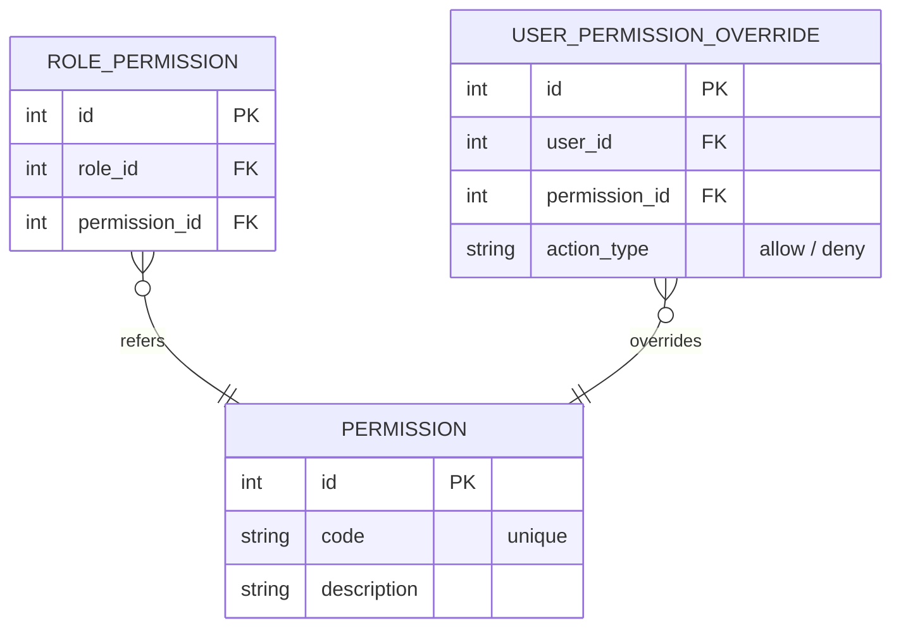

# Вариант №4 — Permission Service (Сервис разрешений)

Микросервис предназначен для тонкой настройки прав доступа в рамках информационной системы колледжа: определение прав на редактирование расписания, просмотр данных и назначение замен.

## ER-диаграмма в 3НФ (Mermaid)

**Список реляционных связей с указанием полей:**
* `ROLE_PERMISSION.permission_id` -> `PERMISSION.id`
* `USER_PERMISSION_OVERRIDE.permission_id` -> `PERMISSION.id`

*Примечание по архитектуре: Поля ROLE_PERMISSION.role_id и USER_PERMISSION_OVERRIDE.user_id по смыслу являются внешними ключами (FK) к сущностям внешних микросервисов (Role Service и Auth/User Service).*

---

## Описание API

### ТАБЛИЦА 1: PERMISSION (Системные разрешения)

#### 1. Добавить сущность
**Информация для создания:**

| Параметр (англ.) | Пояснение | Обязательность | Тип | Ограничение | Значение по умолчанию |
| :--- | :--- | :--- | :--- | :--- | :--- |
| `code` | Уникальный строковый код права | Да | string | макс. 50 симв. | — |
| `description` | Человекочитаемое описание права | Да | string | макс. 255 симв. | — |

*Уникальные комбинации параметров:* `code` (код права не должен повторяться).

**Информация при успешном создании:**

| Параметр (англ.) | Тип |
| :--- | :--- |
| `id` | int |
| `code` | string |
| `description` | string |

#### 2. Изменить сущность по ID
**Информация для изменения:**

| Параметр (англ.) | Пояснение | Обязательность | Тип | Ограничение |
| :--- | :--- | :--- | :--- | :--- |
| `description` | Новое описание назначения права | Нет | string | макс. 255 симв. |

**Информация при успешном изменении:**

| Параметр (англ.) | Тип |
| :--- | :--- |
| `id` | int |
| `code` | string |
| `description` | string |

*Примечание:* Если в запросе не передано параметров для изменения, сервер возвращает статус-код `200 OK` с текущим неизмененным состоянием объекта.

#### 3. Удалить сущность по ID
Согласно требованиям, Permission Service реализует жесткое удаление: запись физически удаляется из БД.

**Возвращаемое значение:**

| Параметр (англ.) | Тип | Пояснение |
| :--- | :--- | :--- |
| `success` | boolean | `true` — если запись найдена и успешно удалена, иначе `false` |

#### 4. Получить сущность по ID
**Возвращаемая информация:**

| Параметр (англ.) | Пояснение | Тип |
| :--- | :--- | :--- |
| `id` | Идентификатор записи | int |
| `code` | Системный код права | string |
| `description` | Описание права | string |

#### 5. Получить список сущностей по заданным параметрам
**Параметры запроса:**

| Параметр (англ.) | Пояснение | Тип |
| :--- | :--- | :--- |
| `code` | Фильтрация по коду права (необязательный) | string |

**Возвращаемый список (с учётом фильтра):**

| Параметр (англ.) | Тип | Пояснение |
| :--- | :--- | :--- |
| `id` | int | Идентификатор записи |
| `code` | string | Системный код права |
| `description` | string | Описание права |

*Логика фильтрации:* При передаче заполненного параметра `code` возвращаются только записи, соответствующие фильтру. При пустом или отсутствующем параметре `code` фильтрация игнорируется, и возвращаются все существующие записи таблицы PERMISSION.

---

### ТАБЛИЦА 2: ROLE_PERMISSION (Связь ролей с правами)

#### 1. Добавить сущность
**Информация для создания:**

| Параметр (англ.) | Пояснение | Обязательность | Тип | Ограничение | Значение по умолчанию |
| :--- | :--- | :--- | :--- | :--- | :--- |
| `role_id` | Идентификатор роли из внешнего сервиса | Да | int | > 0 | — |
| `permission_id` | Идентификатор права из таблицы PERMISSION | Да | int | > 0 | — |

*Уникальные комбинации параметров:* `role_id` + `permission_id` (нельзя привязать одно право к одной роли дважды). При дублировании возвращается ошибка `409 Conflict`.

**Информация при успешном создании:**

| Параметр (англ.) | Тип |
| :--- | :--- |
| `id` | int |
| `role_id` | int |
| `permission_id` | int |

#### 2. Изменить сущность по ID
**Информация для изменения:**

| Параметр (англ.) | Пояснение | Обязательность | Тип | Ограничение |
| :--- | :--- | :--- | :--- | :--- |
| `role_id` | Новый идентификатор роли | Нет | int | > 0 |
| `permission_id` | Новый идентификатор права | Нет | int | > 0 |

**Информация при успешном изменении:**

| Параметр (англ.) | Тип |
| :--- | :--- |
| `id` | int |
| `role_id` | int |
| `permission_id` | int |

*Правила валидации:*
1. Если ни один параметр не передан, возвращается `200 OK` с текущим состоянием записи.
2. При изменении параметров на уже существующую в базе пару `role_id` + `permission_id`, запрос отклоняется с ошибкой `409 Conflict`.

#### 3. Удалить сущность по ID
Реализует жесткое удаление записи.

**Возвращаемое значение:**

| Параметр (англ.) | Тип | Пояснение |
| :--- | :--- | :--- |
| `success` | boolean | `true` — если связь удалена, иначе `false` |

#### 4. Получить сущность по ID
**Возвращаемая информация:**

| Параметр (англ.) | Пояснение | Тип |
| :--- | :--- | :--- |
| `id` | Идентификатор связи | int |
| `role_id` | ID роли | int |
| `permission_id` | ID права | int |

#### 5. Получить список сущностей по заданным параметрам
**Параметры запроса:**

| Параметр (англ.) | Пояснение | Тип |
| :--- | :--- | :--- |
| `role_id` | Фильтр прав для конкретной роли (необязательный) | int |

**Возвращаемый список (с учётом фильтра):**

| Параметр (англ.) | Тип | Пояснение |
| :--- | :--- | :--- |
| `id` | int | Идентификатор записи |
| `role_id` | int | Идентификатор внешней роли |
| `permission_id` | int | Идентификатор локального разрешения |

*Логика фильтрации:* При передаче параметра `role_id` список фильтруется по указанной роли. Если параметр не указан, сервер возвращает полный список всех связей ролей и разрешений.

---

### ТАБЛИЦА 3: USER_PERMISSION_OVERRIDE (Персональные исключения пользователей)

#### 1. Добавить сущность
**Информация для создания:**

| Параметр (англ.) | Пояснение | Обязательность | Тип | Ограничение | Значение по умолчанию |
| :--- | :--- | :--- | :--- | :--- | :--- |
| `user_id` | Идентификатор пользователя из внешнего сервиса | Да | int | > 0 | — |
| `permission_id` | Идентификатор права из таблицы PERMISSION | Да | int | > 0 | — |
| `action_type` | Тип переопределения | Да | string | "allow" или "deny" | — |

*Уникальные комбинации параметров:* `user_id` + `permission_id`. При дублировании возвращается ошибка `409 Conflict`.

**Информация при успешном создании:**

| Параметр (англ.) | Тип |
| :--- | :--- |
| `id` | int |
| `user_id` | int |
| `permission_id` | int |
| `action_type` | string |

#### 2. Изменить сущность по ID
**Информация для изменения:**

| Параметр (англ.) | Пояснение | Обязательность | Тип | Ограничение |
| :--- | :--- | :--- | :--- | :--- |
| `action_type` | Изменить тип правила | Нет | string | "allow" или "deny" |

**Информация при успешном изменении:**

| Параметр (англ.) | Тип |
| :--- | :--- |
| `id` | int |
| `user_id` | int |
| `permission_id` | int |
| `action_type` | string |

*Примечание:* Если параметр `action_type` не передан, сервер оставляет запись без изменений и возвращает HTTP 200 с её текущим состоянием.

#### 3. Удалить сущность по ID
Реализует жесткое удаление записи.

**Возвращаемое значение:**

| Параметр (англ.) | Тип | Пояснение |
| :--- | :--- | :--- |
| `success` | boolean | `true` — если запись удалена, иначе `false` |

#### 4. Получить сущность по ID
**Возвращаемая информация:**

| Параметр (англ.) | Пояснение | Тип |
| :--- | :--- | :--- |
| `id` | ID записи переопределения | int |
| `user_id` | ID пользователя | int |
| `permission_id` | ID права | int |
| `action_type` | Действие правила | string |

#### 5. Получить список сущностей по заданным параметрам
**Параметры запроса:**

| Параметр (англ.) | Пояснение | Тип |
| :--- | :--- | :--- |
| `user_id` | Фильтр правил конкретного пользователя (необязательный) | int |
| `permission_id` | Фильтр правил для конкретного разрешения (необязательный) | int |

**Возвращаемый список (с учётом фильтра):**

| Параметр (англ.) | Тип | Пояснение |
| :--- | :--- | :--- |
| `id` | int | Идентификатор записи |
| `user_id` | int | Идентификатор внешнего пользователя |
| `permission_id` | int | Идентификатор локального разрешения |
| `action_type` | string | Выбранное действие переопределения |

*Логика фильтрации:* При передаче параметров результат фильтруется по логическому пересечению условий (AND). Если параметры отсутствуют, сервер возвращает полный массив всех пользовательских исключений.
