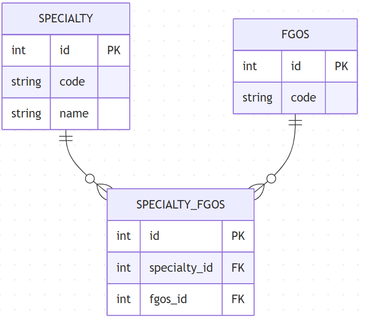

# Отчет по сервису специальностей (Вариант 6)

## ER-диаграмма

---

## 1. Манипулирование данными: Специальность (Specialty)

### Добавить специальность

| Параметр | Обязательность | Тип | Ограничение | Значение по умолчанию |
| :--- | :--- | :--- | :--- | :--- |
| code | Да | String | Unique | - |
| name | Да | String | Not Null | - |

**Возвращает:** Объект Specialty (id, code, name).

### Изменить специальность по ID

| Параметр | Обязательность | Тип | Ограничение | Значение по умолчанию |
| :--- | :--- | :--- | :--- | :--- |
| name | Нет | String | Not Null | - |

**Возвращает:** True в случае успеха.

### Удалить специальность по ID
Вернет **True**, если запись удалена.

---

## 2. Манипулирование данными: ФГОС (FGOS)

### Добавить ФГОС

| Параметр | Обязательность | Тип | Ограничение | Значение по умолчанию |
| :--- | :--- | :--- | :--- | :--- |
| code | Да | String | Unique | - |

**Возвращает:** Объект FGOS (id, code).

### Изменить ФГОС по ID

| Параметр | Обязательность | Тип | Ограничение | Значение по умолчанию |
| :--- | :--- | :--- | :--- | :--- |
| code | Да | String | Unique | - |

**Возвращает:** True в случае успеха.

---

## 3. Манипулирование данными: Связь (SpecialtyFGOS)

### Создать связь (Привязать специальность к ФГОС)

| Параметр | Обязательность | Тип | Ограничение | Значение по умолчанию |
| :--- | :--- | :--- | :--- | :--- |
| specialty_id| Да | Integer | Foreign Key | - |
| fgos_id | Да | Integer | Foreign Key | - |

**Возвращает:** Объект связи (id, specialty_id, fgos_id).

### Получить список специальностей по параметрам

| Параметр | Тип | Описание |
| :--- | :--- | :--- |
| limit | Integer | Кол-во записей |
| offset | Integer | Смещение |

**Возвращает:** Список объектов Specialty.