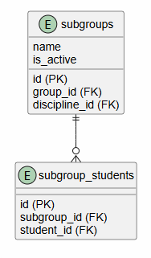

# Вариант №8. Сервис подгрупп (Subgroup Service)

## Таблица `Тип_Подгруппы` (справочник)

| id | name | description |
|----|------|-------------|
| 1 | language | Изучение языков |
| 2 | sport | Спортивные занятия |
| 3 | other | Прочие подгруппы |

## 1. Создать подгруппу
**POST** `/subgroups`

**Информация для создания:**

| Параметр | Обязательность | Тип | Ограничение | Значение по умолчанию |
|----------|---------------|-----|-------------|----------------------|
| name | Обязательно | Строка | language, sport, other | — |
| group_id | Обязательно | Целое | Внешний ключ к группе | — |

**Уникальная комбинация:** `(group_id, type)`

**Выходные данные:**

| Параметр | Тип |
|----------|-----|
| id | Целое |
| name | Строка |
| group_id | Целое |

---

## 2. Изменить подгруппу по ID
**PATCH** `/subgroups/{id}`

**Информация для изменения:**

| Параметр | Обязательность | Тип | Ограничение | Значение по умолчанию |
|----------|---------------|-----|-------------|----------------------|
| name | Обязательно | Строка | language, sport, other | — |

**Выходные данные:**

| Параметр | Тип |
|----------|-----|
| id | Целое |
| name | Строка |
| group_id | Целое |

---

## 3. Удалить подгруппу по ID
**DELETE** `/subgroups/{id}`

**Возвращает:** `True`, если подгруппа была удалена, иначе `False`

---

## 4. Получить подгруппу по ID
**GET** `/subgroups/{id}`

**Выходные данные:**

| Параметр | Тип |
|----------|-----|
| id | Целое |
| name | Строка |
| group_id | Целое |

---

## 5. Получить список подгрупп по заданным параметрам
**GET** `/subgroups`

**Входные параметры (query params):**

| Параметр | Тип | Обязательность | Описание |
|----------|-----|---------------|----------|
| group_id | Целое | Обязательно | Фильтр по группе.  |
| name | Строка | Обязательно | Фильтр по имени language, sport, other.  |

**Выходные данные (массив объектов):**

| Параметр | Тип |
|----------|-----|
| id | Целое |
| name | Строка |
| group_id | Целое |

### ER-диаграмма
 