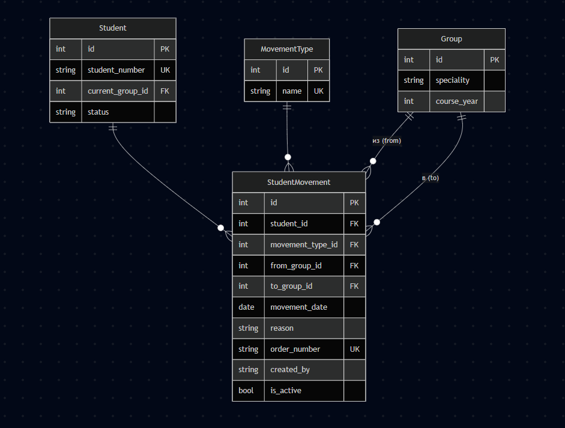

## Описание предметной области

Сервис предназначен для учета движения студентов:
- переводы между группами
- отчисление
- восстановление
- академический отпуск

---

## Students

| Поле | Тип | Ограничения |
|---|---|---|
| id | Integer | PK |
| birth_date | Date | NOT NULL |
| student_number | Varchar | UNIQUE |
| current_group_id | Integer | FK |
| status | Varchar | NOT NULL |

---

## Groups

| Поле | Тип | Ограничения |
|---|---|---|
| id | Integer | PK |
| speciality | Varchar | NOT NULL |
| course_year | Integer | 1-4 |

---

## MovementTypes

| Поле | Тип | Ограничения |
|---|---|---|
| id | Integer | PK |
| name | Varchar | UNIQUE |

Примеры:
- перевод
- отчисление
- восстановление
- академический отпуск

---

## StudentMovements

| Поле | Тип | Ограничения |
|---|---|---|
| id | Integer | PK |
| student_id | Integer | FK |
| movement_type_id | Integer | FK |
| from_group_id | Integer | FK, NULL |
| to_group_id | Integer | FK, NULL |
| movement_date | Date | NOT NULL |
| reason | Text | NOT NULL |
| order_number | Varchar | UNIQUE |
| created_by | Varchar | NOT NULL |

---

## Связи

| Таблица 1 | Связь | Таблица 2 |
|---|---|---|
| Students | 1:M | StudentMovements |
| Groups | 1:M | StudentMovements |
| MovementTypes | 1:M | StudentMovements |

---

## Ограничения

| Поле | Ограничение |
|---|---|
| id | PRIMARY KEY |
| student_number | UNIQUE |
| order_number | UNIQUE |
| student_id | FOREIGN KEY |
| movement_type_id | FOREIGN KEY |

---

## CRUD операции

### Create
Создание движения студента:
- student_id
- movement_type_id
- from_group_id
- to_group_id
- movement_date
- reason
- order_number
- created_by

---

### Read
- получить движение по id
- получить список движений
- фильтрация по студенту / типу / дате

---

### Update
- изменение причины
- изменение группы назначения
- изменение даты

---

### Delete
- удаление записи движения

### ER-диаграмма
